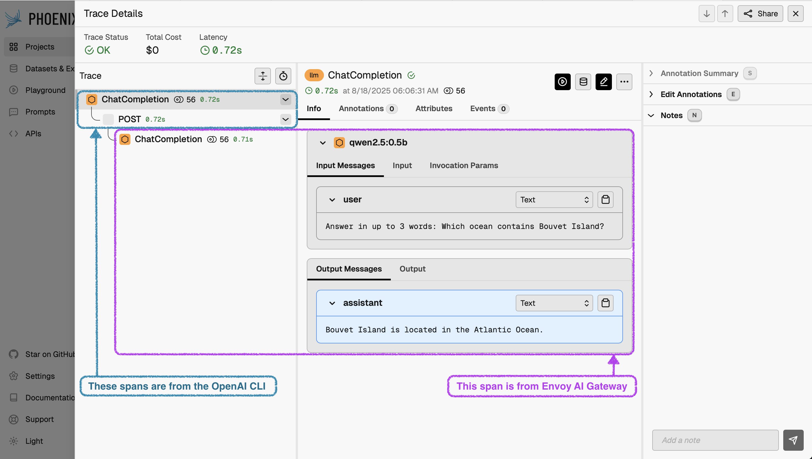

# Envoy AI Gateway CLI (aigw)

## Quick Start

[docker-compose.yaml](docker-compose.yaml) builds and runs `aigw`, targeting
[Ollama][ollama] for OpenAI chat completion requests on port 1975.

- **aigw** (port 1975): Envoy AI Gateway CLI (standalone mode)
- **chat-completion**: curl command making a simple chat completion

The simplest way to get started is to have `aigw` generate a configuration for
your OpenAI-compatible backend. This happens when there is no configuration
file and at least the `OPENAI_API_KEY` environment variable is set.

Here are values we use for Ollama:

- `OPENAI_API_KEY=unused` (Ollama does not require an API key)
- `OPENAI_BASE_URL=http://localhost:11434/v1` (host.docker.internal in Docker)

1. **Start Ollama** on your host machine:

   Start Ollama on all interfaces, with a large context. This allows it to be
   addressable by Docker and handle large tasks, such as from [Goose][goose].

   ```bash
   OLLAMA_CONTEXT_LENGTH=131072 OLLAMA_HOST=0.0.0.0 ollama serve
   ```

2. **Run the example minimal stack**:

   `up` builds `aigw` from source and starts the stack, awaiting health checks.

   ```bash
   docker compose up --wait -d
   ```

3. **Make requests to Envoy AI Gateway**:

   The following services use `curl` to send requests to the AI Gateway CLI
   (aigw) which routes them to Ollama:
   - Chat completion:
     ```bash
     docker compose run --rm chat-completion
     ```
   -
   - Completion (legacy):

     ```bash
     docker compose run --rm completion
     ```

   - Embeddings:

     ```bash
     docker compose run --rm embeddings
     ```

   - MCP (Model Context Protocol) tool call:
     ```bash
     docker compose run --rm mcp
     ```
     This calls the kiwi MCP server through aigw's MCP Gateway at `/mcp`.

4. **Shutdown the example stack**:

   `down` stops the containers and removes the volumes used by the stack.

   ```bash
   docker compose down --remove-orphans
   ```

## Quick Start with OpenTelemetry

[docker-compose-otel.yaml](docker-compose-otel.yaml) includes OpenTelemetry
metrics and tracing.

All profiles below use at least these Docker services:

- **aigw** (port 1975): Envoy AI Gateway CLI with OpenAI endpoints at `/v1/*` and MCP endpoint at `/mcp`
- **chat-completion**: OpenAI Python client for chat completions, instrumented with OpenTelemetry
- **completion**: OpenAI Python client for completions (legacy), instrumented with OpenTelemetry
- **create-embeddings**: OpenAI Python client for embeddings, instrumented with OpenTelemetry

### Prerequisites

1. **Start Ollama** on your host machine:

   Start Ollama on all interfaces, with a large context. This allows it to be
   addressable by Docker and handle large tasks, such as from [Goose][goose].

   ```bash
   OLLAMA_CONTEXT_LENGTH=131072 OLLAMA_HOST=0.0.0.0 ollama serve
   ```

### Configure OpenTelemetry Export

Choose how you want to export telemetry data (traces and metrics). We provide
pre-configured `.env` files for common scenarios:

<details>
<summary>Console (Default - no external dependencies)</summary>

Export telemetry directly to the console for debugging. The `.env.otel.console`
file is already provided and will be used by default when no profile is specified
or when you set `COMPOSE_PROFILES=console`.

This outputs traces and metrics to stdout/stderr. Useful for debugging without
requiring any external services.

</details>

<details>
<summary>Arize Phoenix (LLM-specific observability)</summary>

[Arize Phoenix][phoenix] is an open-source LLM tracing and evaluation system
with UX features for spans formatted with [OpenInference semantics][openinference].

The `.env.otel.phoenix` file is already provided and will be used automatically
when you set `COMPOSE_PROFILES=phoenix`. This also starts the Phoenix service.

This configures:

- OTLP endpoint to Phoenix on port 6006
- Metrics disabled (Phoenix only supports traces)
- Reduced batch delay for demo purposes
</details>

<details>
<summary>otel-tui (Terminal UI for OpenTelemetry)</summary>

[otel-tui][otel-tui] provides a terminal-based UI for viewing OpenTelemetry
traces and metrics in real-time.

The `.env.otel.otel-tui` file is already provided and will be used automatically
when you set `COMPOSE_PROFILES=otel-tui`. This also starts the otel-tui service.

This configures the OTLP endpoint to otel-tui on port 4318.

</details>

### Run the Stack

1. **Start the services**:

   ```bash
   COMPOSE_PROFILES="<profile>" docker compose -f docker-compose-otel.yaml up --build --wait -d
   ```

   Where `<profile>` is:
   - `console` - Export to console for debugging (default if omitted)
   - `otel-tui` - Export to otel-tui Terminal UI (also starts otel-tui service)
   - `phoenix` - Export to Phoenix (also starts Phoenix service)

2. **Send test requests**:

   ```bash
   COMPOSE_PROFILES="<profile>" docker compose -f docker-compose-otel.yaml run --build --rm chat-completion
   COMPOSE_PROFILES="<profile>" docker compose -f docker-compose-otel.yaml run --build --rm create-embeddings
   COMPOSE_PROFILES="<profile>" docker compose -f docker-compose-otel.yaml run --build --rm completion
   COMPOSE_PROFILES="<profile>" docker compose -f docker-compose-otel.yaml run --build --rm mcp
   ```

3. **Check telemetry output**:

   <details>
   <summary>For Console export</summary>

   ```bash
   # View traces and metrics in aigw logs
   docker compose -f docker-compose-otel.yaml logs aigw | grep -E "(SpanContext|gen_ai)"
   ```

   </details>

   <details>
   <summary>For Phoenix export</summary>

   If you configured Phoenix as your OTLP endpoint, you can view detailed traces
   showing the OpenAI CLI (Python) joining a trace with the Envoy AI Gateway CLI
   (aigw), including LLM inputs and outputs served by Ollama:

   

   ```bash
   # Verify Phoenix is receiving traces
   docker compose -f docker-compose-otel.yaml logs phoenix | grep "POST /v1/traces"
   
   # Open Phoenix UI
   open http://localhost:6006
   ```

   </details>

   <details>
   <summary>For otel-tui export</summary>

   ```bash
   # Show TUI in your current terminal session
   docker compose -f docker-compose-otel.yaml attach otel-tui
   
   # Detach by pressing Ctrl+p -> Ctrl+q
   ```

   </details>

   **Access logs with GenAI fields** (always available):

   ```bash
   docker compose -f docker-compose-otel.yaml logs aigw | grep "genai_model_name"
   ```

### Shutdown

**Stop the services**:

```bash
docker compose -f docker-compose-otel.yaml down --remove-orphans
```

---

[ollama]: https://ollama.com/
[goose]: https://block.github.io/goose/
[openinference]: https://github.com/Arize-ai/openinference/tree/main/spec
[phoenix]: https://docs.arize.com/phoenix
[otel-python]: https://opentelemetry.io/docs/zero-code/python/
[otel-tui]: https://github.com/ymtdzzz/otel-tui
