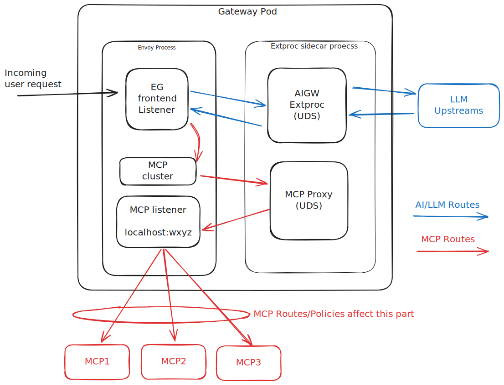

# MCP (Model Context Protocol) Gateway Implementation

## Introduction

[Model Context Protocol] is an open-source standard for connecting AI applications to external systems.
Recently, it has gained significant traction, and implementations of MCP servers are now available across the industry.

Since Envoy AI Gateway aims to be a universal gateway for any AI use case, it is essential to support MCP as a first-class citizen.
This streamlines communication between MCP clients (agents) and MCP servers, which we refer to as the **MCP Gateway**.

This proposal outlines the implementation of the MCP Gateway, specifically how it can be integrated into the existing Envoy AI Gateway architecture.

## Goals

- Leverage the strength of Envoy Proxy / Envoy Gateway as the underlying proxy layer.
- Do not affect the existing functionality of Envoy AI Gateway, notably the `AIGatewayRoutes`.
- Do not add unnecessary complexity to the overall architecture of Envoy AI Gateway (e.g., avoid introducing another standalone component).
- Ensure `aigw run` standalone mode works out of the box as an MCP Gateway, just like the existing LLM Gateway.
- Enable faster iteration by avoiding re-inventing the wheel and decoupling from Envoy core internals as much as possible.
  - The MCP ecosystem evolves _extremely_ rapidly, so we need the ability to iterate quickly without being blocked by Envoy’s release cycle when changes are required.
- The MCP Gateway should provide the following:
  - Support for [Streamable HTTP Transport]. The deprecated SSE transport as well as stdio are out of scope.
  - From the client’s perspective, it should behave like a standard MCP server.
  - The ability to proxy multiple backend MCP servers as a single MCP server.
  - Authentication and Authorization primitives to protect the gateway and MCP method calls.
  - A flexible API that can be cleanly extended to support new use cases as adoption grows.
  - Basic load balancing and other rich Envoy features (e.g., Rate Limiting, Circuit Breaking).
  - Built-in observability (metrics and tracing).
  - Coverage for all JSON-RPC methods defined in the MCP spec, not limited to "Tool Call" but including "Notifications", etc.

From this point, we focus only on the Streamable HTTP transport.

## Quick Overview of MCP Protocol

- MCP is built on top of [JSON-RPC] 2.0 with streaming support via SSE (server-sent events), allowing multiple JSON-RPC messages in a single HTTP response.
- MCP is stateful: a "session" is created before making tool calls, and a `session-id` header is required in every subsequent request.
- From a network gateway/proxy perspective, JSON-RPC methods fall into two categories: "Tool Call" and "Notifications."
  Tool calls are the main way for AI agents to interact with the outside world.
- Multiple streams can be created within a single session. Typically, one (logical) thread polls notifications by making GET requests that receive a long-lived SSE response, while another thread makes POST requests to call tools.

## Challenges

- **Session Management**: We need to dynamically route tool calls to different backend MCP upstreams, so proper session state management is required.
  Since notifications exist, clients must be able to resume notification streams using the `Last-Event-ID` header.
- **Notification Handling**: The GET request for notifications creates a long-lived SSE stream (no content-length). To support "aggregation," the proxy must merge multiple SSE streams from different MCP servers into a single SSE stream for clients. This can be done by either:
  - Terminating the client SSE stream, opening multiple SSE streams to MCP servers, and merging the results into one stream for the client.
  - Ignoring upstream notifications and generating notifications directly by maintaining local state.

## Implementation

The diagram below shows the request flow, compared with usual AIGW LLM requests:



- The key component is the **MCP Proxy**. It runs inside the AIGW sidecar process, making its architecture identical to the normal AIGW model. This minimizes changes needed in the AIGW control plane as well as reduces the maintenance cost.
- The MCP Proxy is accessed via an Envoy cluster ("MCP cluster" in the diagram) that listens on a Unix Domain Socket (UDS), routing all MCP requests.
- The **MCP listener** listens on a local port, allowing the MCP Proxy to reach any MCP backend without needing detailed knowledge of it.
  - This is the routing component that sends actual requests to backends, fully leveraging Envoy’s load balancing, connection handling, fallback, rate limiting, etc.
  - This component is optional in theory. MCP Proxy could directly talk to MCP servers, but that would require re-implementing networking features in Go.
  - This design lets us fully leverage Envoy’s strength as a proxy and focus only on MCP-specific logic.

> [!Note]
> Although MCP Proxy is a Go HTTP server, requests are accepted from Envoy locally and sent to another local Envoy port. Both inbound and outbound traffic is proxied by Envoy, allowing us to leverage its battle-tested networking stack. The current implementation also uses Envoy Gateway’s TLS configuration, letting us focus solely on MCP Proxy logic.

See [Technical Gap between Envoy’s Extension vs the Protocol](#technical-gap-between-envoys-extension-vs-the-protocol) for why we chose MCP Proxy over Envoy’s native extension mechanism.

### Session Handling

Sessions are initialized by sending an "initialize" request to each **matching** upstream MCP server.
All session IDs are encoded into a single (ASCII) session ID, which is then encrypted to avoid leaking details.
See [Future Work & Notes](#future-work--notes) for more on this approach.

### Notification & Reconnection Handling

Notifications are delivered via long-lived SSE streams in response to GET requests, or inline with POST responses.
The MCP Proxy terminates the client SSE stream, opens multiple SSE streams to matching MCP servers, and merges messages into a single stream for the client.

During merging, the MCP Proxy constructs unified Event IDs so reconnections using `Last-Event-ID` can properly resume across all upstream servers.

### Server-to-Client Requests

MCP includes a small set of JSON-RPC requests sent from the server to the client (e.g., `elicitation/create`).
These arrive via the notification stream, and the client must respond.

To ensure responses are routed to the correct upstream MCP server, the MCP Proxy encodes server information into the JSON-RPC `ID` field.
This allows any MCP Proxy instance—not just the original one—to correctly forward responses.

### Distributed Tracing

The MCP Proxy supports distributed tracing by propagating trace context from incoming requests.
W3C Trace Propagation is done via [the \_meta field](https://modelcontextprotocol.io/specification/2025-06-18/basic#general-fields)
on the JSON-RPC messages.

Several agent SDKs such as the [C#](https://github.com/modelcontextprotocol/csharp-sdk/tree/main/src/ModelContextProtocol.Core),
[Typescript](https://github.com/modelcontextprotocol/typescript-sdk) or
[OpenInference Python MCP](https://github.com/Arize-ai/openinference/tree/main/python/instrumentation/openinference-instrumentation-mcp), already propagate the trace context in the
`_meta` field, so using that field will make the implementation compatible with existing exosystem. The tracing metadata
looks like:

```json
{
  "jsonrpc": "2.0",
  "method": "tools/call",
  "params": {
    "name": "weather_tool",
    "arguments": {...},
    "_meta": {
      "traceparent": "00-4bf92f3577b34da6a3ce929d0e0e4736-00f067aa0ba902b7-01",
      "tracestate": "congo=t61rcWkgMzE",
      "progressToken": "abc123"  // MCP-defined field
    }
  }
}
```

## Technical Gap between Envoy’s Extension vs the Protocol

It is natural to consider Envoy’s native extension mechanisms (e.g., ExtProc, already used in this project).
However, limitations exist:

- Currently, ExtProc and other extension mechanisms cannot reply with **streaming responses** locally from the filter.
  - This is necessary to terminate client SSE streams and manage them properly.
  - Without this, clients reconnect with exponential backoff, which is undesirable.
  - A possible workaround is replying locally with a dummy response, then using [StreamEncoderFilterCallbacks->addEncodedData] with `streaming_filter=true`. However, this is only available in C++ filters in Envoy’s stable releases.
  - Or, writing a terminal HTTP filter in C++ that constructs all responses locally, by using AsyncClient rather than relying on Envoy's normal HTTP router.
- Currently, ExtProc and most other mechanisms (except native C++ filters) cannot make **streaming callouts** to arbitrary upstream clusters.
  - This is required to aggregate long-lived notification streams from multiple MCP servers.
  - Existing callout mechanisms in DynamicModules/Wasm/Lua are performed in a buffered manner, which is unsuitable for long-lived streams.
  - Technically, ExtProc/DynamicModules could call MCP servers directly, but this bypasses Envoy features like load balancing and rate limiting.
  - This limitation stems from the lack of support for [AsyncClient->startRequest] in extension APIs.
  - This also necessitates the "MCP listener" so the MCP Proxy can reach arbitrary upstreams.

In short, native C++ extensions would require hacky workarounds in addition to higher maintenance costs, while other mechanisms depend on upstream Envoy changes before becoming feasible.

## Future Work & Notes

- Encoding all session information into a session-id header is not ideal. We could use Redis or another external cache to store session state, simplifying and strengthening the implementation.
  - Envoy (AI) Gateway deployments already commonly use Redis for rate limiting, which makes this approach practical.
  - In practice, the number of matching backends per MCPRoute (per session) will likely remain small (e.g., Goose recommends limiting tools to 25: [block/goose#2927]), making the current approach workable.
- Switching from the MCP Proxy approach to a normal Envoy filter extension could be considered later.
  - Native C++ extensions are out of scope due to complexity, maintenance burden, and difficulty attracting contributors. This leaves ExtProc/DynamicModules/Wasm/Lua as future options.
  - Each requires non-trivial upstream Envoy changes to be feasible.
    - For example, to make dynamic modules feasible, [envoyproxy/envoy#41181] as well as [AsyncClient->startRequest] API support are needed.
  - We must also consider trade-offs: while native filters **may** provide small performance gains, they could slow iteration speed.
  - Fortunately, the current implementation is straightforward enough to be ported if needed.
    Our full coverage of MCP JSON-RPC methods in e2e tests gives confidence in a smooth transition.

[Model Context Protocol]: https://modelcontextprotocol.io/docs/getting-started/intro
[Streamable HTTP Transport]: https://modelcontextprotocol.io/specification/2025-06-18/basic/transports#streamable-http
[JSON-RPC]: https://www.jsonrpc.org/specification
[AsyncClient->startRequest]: https://github.com/envoyproxy/envoy/blob/437946fcbdb4861e09d4d64df83d194b5afe3c57/envoy/http/async_client.h#L494
[StreamEncoderFilterCallbacks->addEncodedData]: https://github.com/envoyproxy/envoy/blob/437946fcbdb4861e09d4d64df83d194b5afe3c57/envoy/http/filter.h#L1038
[envoyproxy/envoy#41087]: https://github.com/envoyproxy/envoy/pull/41087
[block/goose#2927]: https://github.com/block/goose/issues/2927
[envoyproxy/envoy#41181]: https://github.com/envoyproxy/envoy/issues/41181
