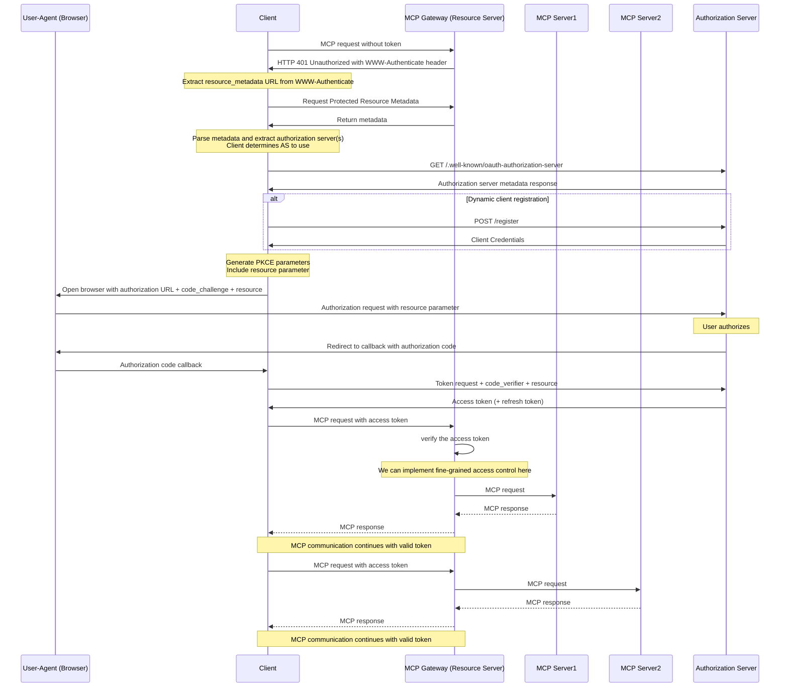

## MCP Proxy Examples for `aigw run`

We have a couple of example configurations for running an MCP Proxy using `aigw run`.

You need to set `GITHUB_ACCESS_TOKEN` environment variable necessary for the GitHub backend to work.

### Using a standard MCP servers file

The easiest way to use MCP servers config is to inline or supply a path to a JSON file containing
an array of MCP server definitions.

For example, to start Envoy AI Gateway to proxy OpenAI and Kiwi MCP servers, use the following command:

```
OPENAI_API_KEY=sk-xxxx aigw run --mcp-json '{"mcpServers":{"kiwi":{"type":"http","url":"https://mcp.kiwi.com"}}}'
```

A docker example is in the [aigw README](../../cmd/aigw/README.md) including OpenTelemetry configuration.
You can also read the [docs](https://aigateway.envoyproxy.io/docs/cli/aigwrun) for more.

### Using an Envoy AI Gateway specific config file

The `mcp_example.yaml` in this directory contains the configuration in the native Envoy AI Gateway format. Although this
format is more verbose, allows for more fine-grained configuration and allows adding features like OAuth authentication, etc.

To run the MCP Proxy with this configuration, use the following command (may take a while to start):

```
$ go run ./cmd/aigw run ./examples/mcp/mcp_example.yaml --debug
```

Then, you can use the MCP Inspector to interact with the MCP Proxy:

## MCP Inspector Examples

### List Tools

```
$ npx @modelcontextprotocol/inspector --cli http://localhost:1975/mcp --transport http --method 'tools/list' | jq '.tools[] | .name'
"context7__resolve-library-id"
"context7__get-library-docs"
"github__pull_request_read"
"kiwi__search-flight"
```

### Accessing GitHub Pull Request Info

```
$ npx @modelcontextprotocol/inspector --cli http://localhost:1975/mcp --transport http --method tools/call --tool-name github__pull_request_read --tool-arg method="get" --tool-arg owner="envoyproxy" --tool-arg repo="ai-gateway" --tool-arg pullNumber=1 | jq '.content[0] | .text'
"{\"id\":2136495058,\"number\":1,\"state\":\"closed\",\"locked\":false,\"title\":\"Initial README.md update with one-liner description.\",\"body\":\"Adding a one liner description to the project.\",\"created_at\":\"2024-10-21T16:05:59Z\",\"updated_at\":\"2024-10-21T16:08:23Z\",\"closed_at\":\"2024-10-21T16:08:23Z\",\"merged_at\":\"2024-10-21T16:08:23Z\",\"user\":{\"login\":\"missBerg\",\"id\":17533717,\"node_id\":\"MDQ6VXNlcjE3NTMzNzE3\",\"avatar_url\":\"https://avatars.githubusercontent.com/u/17533717?v=4\",\"html_url\":\"https://github.com/missBerg\",\"gravatar_id\":\"\",\"type\":\"User\",\"site_admin\":false,\"url\":\"https://api.github.com/users/missBerg\",\"events_url\":\"https://api.github.com/users/missBerg/events{/privacy}\",\"following_url\":\"https://api.github.com/users/missBerg/following{/other_user}\",\"followers_url\":\"https://api.github.com/users/missBerg/followers\",\"gists_url\":\"https://api.github.com/users/missBerg/gists{/gist_id}\",\"organizations_url\":\"https://api.github.com/users/missBerg/orgs\",\"received_events_url\":\"https://api.github.com/users/missBerg/received_events\",\"repos_url\":\"https://api.github.com/users/missBerg/repos\",\"starred_url\":\"https://api.github.com/users/missBerg/starred{/owner}{/repo}\",\"subscriptions_url\":\"https://api.github.com/users/missBerg/subscriptions\"},\"draft\":false,\"url\":\"https://api.github.com/repos/envoyproxy/ai-gateway/pulls/1\",\"html_url\":\"https://github.com/envoyproxy/ai-gateway/pull/1\",\"issue_url\":\"https://api.github.com/repos/envoyproxy/ai-gateway/issues/1\",\"statuses_url\":\"https://api.github.com/repos/envoyproxy/ai-gateway/statuses/eed3f2d3cca88b405d8dc289e56cc2f3477b7dbf\",\"diff_url\":\"https://github.com/envoyproxy/ai-gateway/pull/1.diff\",\"patch_url\":\"https://github.com/envoyproxy/ai-gateway/pull/1.patch\",\"commits_url\":\"https://api.github.com/repos/envoyproxy/ai-gateway/pulls/1/commits\",\"comments_url\":\"https://api.github.com/repos/envoyproxy/ai-gateway/issues/1/comments\",\"review_comments_url\":\"https://api.github.com/repos/envoyproxy/ai-gateway/pulls/1/comments\",\"review_comment_url\":\"https://api.github.com/repos/envoyproxy/ai-gateway/pulls/comments{/number}\",\"author_association\":\"MEMBER\",\"node_id\":\"PR_kwDONDTgas5_WFPS\",\"merged\":true,\"mergeable_state\":\"unknown\",\"merged_by\":{\"login\":\"mathetake\",\"id\":13513977,\"node_id\":\"MDQ6VXNlcjEzNTEzOTc3\",\"avatar_url\":\"https://avatars.githubusercontent.com/u/13513977?v=4\",\"html_url\":\"https://github.com/mathetake\",\"gravatar_id\":\"\",\"type\":\"User\",\"site_admin\":false,\"url\":\"https://api.github.com/users/mathetake\",\"events_url\":\"https://api.github.com/users/mathetake/events{/privacy}\",\"following_url\":\"https://api.github.com/users/mathetake/following{/other_user}\",\"followers_url\":\"https://api.github.com/users/mathetake/followers\",\"gists_url\":\"https://api.github.com/users/mathetake/gists{/gist_id}\",\"organizations_url\":\"https://api.github.com/users/mathetake/orgs\",\"received_events_url\":\"https://api.github.com/users/mathetake/received_events\",\"repos_url\":\"https://api.github.com/users/mathetake/repos\",\"starred_url\":\"https://api.github.com/users/mathetake/starred{/owner}{/repo}\",\"subscriptions_url\":\"https://api.github.com/users/mathetake/subscriptions\"},\"merge_commit_sha\":\"6ac636f42549f6166821f06f3127051c56d3f366\",\"comments\":0,\"commits\":0,\"additions\":0,\"deletions\":0,\"changed_files\":0,\"maintainer_can_modify\":false,\"review_comments\":0,\"_links\":{\"self\":{\"href\":\"https://api.github.com/repos/envoyproxy/ai-gateway/pulls/1\"},\"html\":{\"href\":\"https://github.com/envoyproxy/ai-gateway/pull/1\"},\"issue\":{\"href\":\"https://api.github.com/repos/envoyproxy/ai-gateway/issues/1\"},\"comments\":{\"href\":\"https://api.github.com/repos/envoyproxy/ai-gateway/issues/1/comments\"},\"review_comments\":{\"href\":\"https://api.github.com/repos/envoyproxy/ai-gateway/pulls/1/comments\"},\"review_comment\":{\"href\":\"https://api.github.com/repos/envoyproxy/ai-gateway/pulls/comments{/number}\"},\"commits\":{\"href\":\"https://api.github.com/repos/envoyproxy/ai-gateway/pulls/1/commits\"},\"statuses\":{\"href\":\"https://api.github.com/repos/envoyproxy/ai-gateway/statuses/eed3f2d3cca88b405d8dc289e56cc2f3477b7dbf\"}},\"head\":{\"label\":\"missBerg:main\",\"ref\":\"main\",\"sha\":\"eed3f2d3cca88b405d8dc289e56cc2f3477b7dbf\",\"repo\":{\"id\":876227501,\"node_id\":\"R_kgDONDorrQ\",\"owner\":{\"login\":\"missBerg\",\"id\":17533717,\"node_id\":\"MDQ6VXNlcjE3NTMzNzE3\",\"avatar_url\":\"https://avatars.githubusercontent.com/u/17533717?v=4\",\"html_url\":\"https://github.com/missBerg\",\"gravatar_id\":\"\",\"type\":\"User\",\"site_admin\":false,\"url\":\"https://api.github.com/users/missBerg\",\"events_url\":\"https://api.github.com/users/missBerg/events{/privacy}\",\"following_url\":\"https://api.github.com/users/missBerg/following{/other_user}\",\"followers_url\":\"https://api.github.com/users/missBerg/followers\",\"gists_url\":\"https://api.github.com/users/missBerg/gists{/gist_id}\",\"organizations_url\":\"https://api.github.com/users/missBerg/orgs\",\"received_events_url\":\"https://api.github.com/users/missBerg/received_events\",\"repos_url\":\"https://api.github.com/users/missBerg/repos\",\"starred_url\":\"https://api.github.com/users/missBerg/starred{/owner}{/repo}\",\"subscriptions_url\":\"https://api.github.com/users/missBerg/subscriptions\"},\"name\":\"ai-gateway-old\",\"full_name\":\"missBerg/ai-gateway-old\",\"default_branch\":\"main\",\"created_at\":\"2024-10-21T15:58:25Z\",\"pushed_at\":\"2025-07-29T20:21:41Z\",\"updated_at\":\"2025-07-29T20:26:19Z\",\"html_url\":\"https://github.com/missBerg/ai-gateway-old\",\"clone_url\":\"https://github.com/missBerg/ai-gateway-old.git\",\"git_url\":\"git://github.com/missBerg/ai-gateway-old.git\",\"ssh_url\":\"git@github.com:miss
```

## Authenticating with an MCP Auth-Compatible OAuth2 Server

The following sequence diagram illustrates how MCP Gateway helps an MCP server that does not support OAuth2 to authenticate
and authorize with an OAuth2 Authorization Server (AS) using the OAuth2 Authorization Code Flow defined in the [MCP Authorization
specification](https://modelcontextprotocol.io/specification/2025-06-18/basic/authorization).



Let's test this with Claud code.

First, start a Keycloak auth server with Docker:

```
docker run --name mykeycloak -p 127.0.0.1:8080:8080 \
        -e KC_BOOTSTRAP_ADMIN_USERNAME=admin -e KC_BOOTSTRAP_ADMIN_PASSWORD=change_me \
        quay.io/keycloak/keycloak:latest \
        start-dev
```

Log in to the admin console at http://localhost:8080 and delete the Trusted Hosts policy for client registration.
This enables dynamic client registration from localhost.

⚠️ Note: This is insecure and should only be used for local testing.
In production, configure a proper Trusted Hosts policy that matches your environment.

Run the MCP Gateway with configuration that uses Keycloak for OAuth2:

```
$ go run ./cmd/aigw run ./examples/mcp/mcp_oauth_keycloak.yaml --debug
```

Then, add the MCP gateway to Claude:

```
claude mcp add -t http mcp-gateway http://127.0.0.1:1975/mcp
```

Open it inside Claude:

```
/mcp mcp-gateway
```

When prompted, click Authentication. You’ll see output like:

```
> /mcp mcp-gateway

Authenticating with mcp-gateway…

·  A browser window will open for authentication

If your browser doesn't open automatically, copy this URL manually:
http://localhost:8080/realms/master/protocol/openid-connect/auth?response_type=code&client_id=d73a6849-2fc3-4a3e-8035-5ccbded52be2&code_challenge=BCVyqS1thrzTUAc7_Dz_B-ZXKPXMzvj4zrpowuhJP_M
&code_challenge_method=S256&redirect_uri=http%3A%2F%2Flocalhost%3A64442%2Fcallback&state=EpHCh4LIqmnwE3goyNPw1HNxv5yEZtArudQwRRaMr4A&resource=http%3A%2F%2F127.0.0.1%3A1975%2Fmcp

   Return here after authenticating in your browser. Press Esc to go back.
```

A browser window opens with the Keycloak login page.
Log in using the credentials you set (admin / change_me in this example).

Once authenticated, Claude will confirm:

```
> /mcp mcp-gateway
  ⎿  Authentication successful. Connected to mcp-gateway.
```

Now you can explore the available tools:

```
> /mcp
╭────────────────────────────────────────────────────────────────────╮
│ Tools for mcp-gateway (3 tools)                                    │
│                                                                    │
│ ❯ 1. search-flight                                                 │
│   2. microsoft_docs_search                                         │
│   3. microsoft_docs_fetch                                          │
╰────────────────────────────────────────────────────────────────────╯
   Esc to go back
```

From here, you can start using the tools inside Claude.

```
> Find the cheapest flight tickets from LA to SF.

⏺ I'll help you find the cheapest flight tickets from LA to San Francisco. Let me search for flights for today's date.

⏺ mcp-gateway - search-flight (MCP)(flyFrom: "Los Angeles", flyTo: "San Francisco", departureDate: "13/09/2025", sort: "price", curr: "USD")
  ⎿  [
       {
         "flyFrom": "LAX",
     … +284 lines (ctrl+r to expand)

⏺ Flight Search Results - LA to SF (September 13, 2025)

  Cheapest Flights 💰

  | Route     | Departure → Arrival          | Class   | Price | Book                       |
  |-----------|------------------------------|---------|-------|----------------------------|
  | LAX → SFO | 13/09 08:16 → 09:50 (1h 34m) | Economy | $124  | https://on.kiwi.com/DrZd51 |
  | LAX → SFO | 13/09 16:41 → 18:13 (1h 32m) | Economy | $129  | https://on.kiwi.com/F8u8Sc |
  | LAX → SFO | 13/09 16:41 → 18:13 (1h 32m) | Economy | $134  | https://on.kiwi.com/NBMEYO |
```

## Tracing example with a Python agent

The [agent.py](agent.py) file contains a basic Python agent example that evaluates the given prompt on the configured
OpenAI compatible provider.

Refer to the [cmd/aigw](../../cmd/aigw) directory README and Docker files for details and examples on
how to start the different example OpenTelemetry compatible services.

Once you have everything running you can start the agent by passing a prompt file or directly typing it
into the terminal.

```shell
$ uv run --exact -q --env-file .env agent.py /path/to/prompt.txt
```

or

```shell
$ uv run --exact -q --env-file .env agent.py << EOF
> your prompt here
EOF
```
