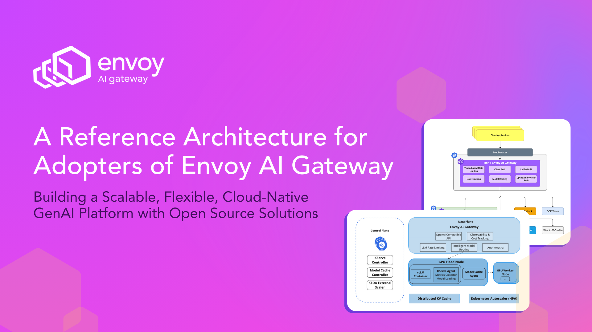
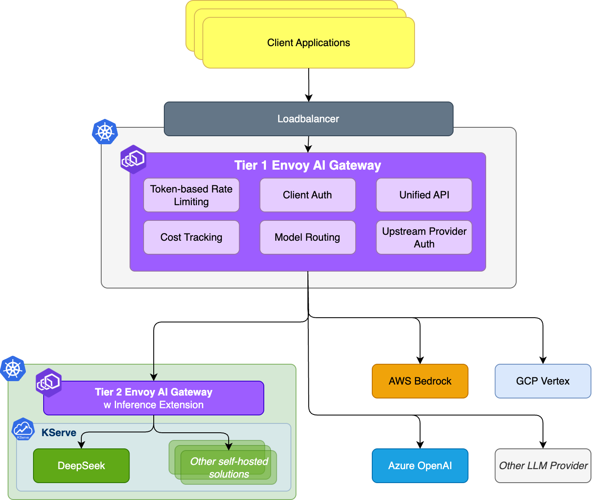
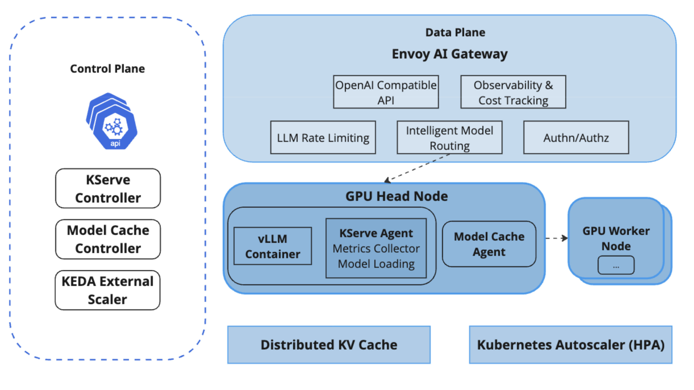

# A Reference Architecture for Adopters of Envoy AI Gateway

# Building a Scalable, Flexible, Cloud-Native GenAI Platform with Open Source Solutions

AI workloads are complex, and unmanaged complexity kills velocity. Your architecture is the key to mastering it.

As generative AI (GenAI) becomes foundational to modern software products, developers face a chaotic new reality, juggling different APIs from various providers while also attempting to deploy self-hosted open-source models. This leads to credential sprawl, inconsistent security policies, runaway costs, and an infrastructure that is difficult to scale and govern.

**Your architecture doesn’t have to be this complex.**

Platform engineering teams need a secure, scalable way to serve both internal and external LLMs to their users. That’s where Envoy AI Gateway comes in.

This reference architecture outlines how to build a flexible GenAI platform using the open source solutions Envoy AI Gateway, KServe, and complementary tools. Whether you're self-hosting models or integrating with model-serving services on cloud providers, such as OpenAI and Anthropic, this architecture enables a unified, governable interface for LLM traffic.

---

## Core Architecture: Two-Tier Gateway Design

The foundation of this platform is a Two-Tier Gateway Architecture:

### Tier One Gateway
Deployed in a centralized Gateway Cluster. It serves as the main API traffic entry point for client applications.

**Its Job:** To route traffic to external LLM providers (e.g., OpenAI, Anthropic, Bedrock, Vertex) or to the appropriate internal gateway to access an internal model-serving cluster.

**Why It Matters:** This gateway provides a unified API for all application developers. They don't need to know or care if a model is hosted by a third party or in-house. It centralizes coarse-grained policies, such as authentication, top-level routing, and global rate limiting, simplifying the developer experience and providing a single control point for platform-wide governance.

### Tier Two Gateway
Deployed as part of a self-hosted model serving cluster

**Its Job:** To handle internal traffic routing, load balancing, and policy enforcement specific to self-hosted models running on platforms like KServe.

**Why It Matters:** This empowers platform teams. They can manage model versions, conduct releases, and apply specific security rules for self-hosted models without needing to make changes to the primary, customer-facing gateway. This separation ensures that internal operational changes don't impact external clients.

_Follow the work to support the Gateway API Inference Extension in Envoy AI Gateway in issue [#423](https://github.com/envoyproxy/ai-gateway/issues/423)_

### Design Benefits
This design cleanly separates external access from internal implementation, giving teams the autonomy they need to move fast without breaking things, and provides:

* Centralized credential management
* Unified API access
* Cost tracking and traffic governance

### Routing and Traffic Management

Envoy AI Gateway provides a consistent client interface and abstracts the complexity of accessing diverse GenAI backends. It supports:

| Feature | Problem | Solution |
|---------|---------|----------|
| **Upstream Authentication with Credential Injection** | Application developers must manage, store, and rotate API keys for multiple external LLM providers. This is a security risk and an operational burden that slows down development. | The gateway injects the correct credentials per provider. Developers can make requests to the gateway using a single, internal authentication token, and the gateway handles attaching the appropriate third-party API key. **This decouples applications from external secrets, dramatically improving security and simplifying code.** |
| **Token-Based Rate Limiting and Cost Optimization** | A single buggy script or a new feature can lead to unexpected spikes in usage, resulting in huge bills from LLM providers or overwhelming your self-hosted infrastructure. | The gateway acts as an intelligent financial and operational circuit breaker. You can enforce policies based on token usage, requests, or estimated cost. **This prevents abuse and ensures that you stay within budget, providing critical protection for the business.** |
| **Observability Hooks for Usage Patterns and Latency** | When you use multiple model providers, it's nearly impossible to get a clear picture of usage. Which teams are spending the most? Which models have the highest latency? How many tokens is our new feature consuming? | By routing all traffic through a single point, the gateway provides a unified source of truth and built-in support for metrics, logs, and traces tailored for GenAI workloads. **This enables you to accurately track costs, identify performance bottlenecks, and understand usage patterns across your entire GenAI stack.**|

:::tip
Clients simply hit a single endpoint and let the Gateway handle routing to the appropriate backend—self-hosted or third-party.
:::
---

## Self-Hosted Model Serving with KServe

While many organizations start with external providers, self-hosting models offer advantages in terms of cost, privacy, and customization. If you are self-hosting models, KServe is a powerful addition.

For many data scientists and ML engineers, turning a trained model into a production-ready API is a major hurdle that requires deep expertise in Kubernetes, networking, and infrastructure. KServe bridges this gap and eliminates the complexity. KServe is a model serving platform that automates the heavy lifting, allowing an engineer to simply provide a configuration file for their model while KServe builds the scalable, resilient API endpoint.

**A few highlights of what KServe provides:**

* Autoscaling (including token-based autoscaling for LLMs and scale-to-zero for GPUs)
* Multi-node inference (via vLLM)
* Support for OpenAI-compatible APIs and advanced runtime integrations (vLLM)
* Built-in support for model and prompt caching

Check out the [KServe Documentation](https://kserve.github.io/website/latest/) to learn more about all the capabilities.

Use tools like Backstage to simplify model deployment and namespace management for teams.

:::info
Self-hosting is optional. Many adopters will initially rely on external providers and add internal hosting as requirements evolve.
:::

---

## Observability, Control, and Optimization for Production Readiness

In a production GenAI platform environment, observability, control, and optimization become must-haves. Envoy AI Gateway and KServe offer integrations that cater to these needs.

### Observability

Achieving visibility into your system enables the identification of bottlenecks, effective cost management, and ensures model reliability.

* **Unified Metrics and Tracing:**
  * Envoy AI Gateway integrates seamlessly with **OpenTelemetry**, adhering to the GenAI Semantic Conventions. This delivers a unified view of requests, latency, token usage, and errors across all external and internal models.
  * Leverage specialized telemetry, like **OpenLLMetry**, for granular insights into LLM-specific metrics, ensuring you capture essential details like prompt and completion lengths, token throughput, and model-specific performance.
* **Centralized Logging:**
  * Centralize logging across providers through Envoy AI Gateway, facilitating easier debugging, auditing, and compliance.

### Control

Enforcing policies and controls ensures your platform remains secure, stable, and cost-effective:

* **Policy Enforcement and Guardrails:**
  * Set usage-based guardrails directly in Envoy AI Gateway to prevent cost overruns, enforce compliance, and safeguard against prompt misuse or model hallucination.
  * Implement safety checks and output validation rules that enable your team to control quality and compliance centrally, rather than embedding these checks individually within applications.

### Optimization

Maximizing the efficiency and responsiveness of your models can significantly enhance user experience and operational efficiency:

* **Caching Strategies:**
  * KServe's **model caching** further optimizes inference, significantly lowering response times and improving model utilization.
* **Disaggregated Serving:**
  * Optimize hardware resources by leveraging KServe’s support for **disaggregated inference**, which enables the separate management of compute-intensive inference stages and memory-intensive operations, thereby maximizing hardware efficiency and reducing costs.

:::info
Be sure to review the documentation for each project to learn more about preparing your setup for production.
:::

---

## Pluggable and Flexible

This is not a rigid, all-or-nothing platform. It’s a set of foundational components you can adopt and extend to fit your unique environment. This architecture works whether you're fully committed to Kubernetes or using a hybrid cloud.

**You can:**

* Start with externally hosted LLMs or self-hosted inference
* Use Envoy AI Gateway with any compatible provider via a unified API
* Add your own authorization logic and/or custom functionality via Envoy’s extension filters
* Deploy your Gateways in different clusters and cloud providers, giving you flexibility of choice in hosting environments

This is not a rigid platform. It’s a foundational component you can build on and extend.

---

## Summary

The Envoy AI Gateway reference architecture gives platform teams a guide to:

* Centralize access to GenAI models with a unified API
* Enforce consistent traffic and security policies across model providers
* Support both internal and external LLM usage without refactoring client applications
* Scale safely and cost-effectively without reinventing core infrastructure

Envoy AI Gateway sits at the heart of this design, an intelligent, extensible control point for all your GenAI traffic.
