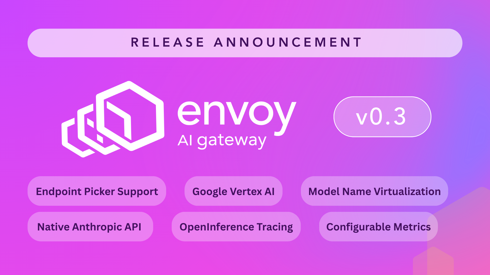

# Envoy AI Gateway v0.3: Intelligent Inference Routing and Production-Ready AI Infrastructure



The **Envoy AI Gateway v0.3** release introduces **intelligent inference routing** through Endpoint Picker (EPP) integration, expands our provider ecosystem with **Google Vertex AI Production Support** as well as **Native Anthropic API**, and delivers **Enterprise-Grade Observability** with OpenInference tracing.

## **The Big Shifts in v0.3**

Envoy AI Gateway v0.3 isn't just another feature release; it's a **fundamental shift** toward intelligent, production-ready AI infrastructure. This release addresses three critical challenges that have been holding back AI adoption in enterprise environments:

<!-- truncate -->

### 1\. From Static to Intelligent Routing

Traditional load balancers treat AI inference endpoints like web servers, but AI workloads are fundamentally different. With **Endpoint Picker integration**, Envoy AI Gateway now makes intelligent routing decisions based on real-time AI-specific metrics like KV-cache usage, queue depth, and LoRA adapter information.

**What this means for you:**

| Benefit                             | Description                                                          |
| ----------------------------------- | -------------------------------------------------------------------- |
| **Latency reduction**               | Optimal endpoint selection based on real-time AI metrics             |
| **Automatic resource optimization** | Intelligent resource allocation across your inference infrastructure |
| **Zero manual intervention**        | Automated endpoint management without operational overhead           |

### 2\. Expanded Provider Ecosystem

We've moved beyond experimental integrations to deliver **production-grade support** for the AI providers that matter most to enterprises.

**Google Vertex AI** is now supported with complete streaming capabilities for Gemini models. **Anthropic on Vertex AI** moves from experimental to production-ready with multi-tool support and configurable API versions.

**What this means for you:**

| Benefit                           | Description                                                              |
| --------------------------------- | ------------------------------------------------------------------------ |
| **Unified OpenAI-compatible API** | Single interface across Google, Anthropic, AWS, and more providers       |
| **Enterprise-grade reliability**  | Production-ready stability for mission-critical AI workloads             |
| **Provider flexibility**          | Switch between providers without architectural changes or vendor lock-in |

### 3\. Enterprise Observability for AI

AI workloads require specialized observability that traditional monitoring tools can't provide. v0.3 delivers comprehensive AI-specific monitoring across four key areas.

**What this means for you:**

| Observability Feature           | Description                                                               |
| ------------------------------- | ------------------------------------------------------------------------- |
| **OpenInference tracing**       | Complete request lifecycle visibility and evaluation system compatibility |
| **Configurable metrics labels** | Granular monitoring based on request headers for custom filtering         |
| **Embeddings metrics support**  | Comprehensive token usage tracking for accurate cost attribution          |
| **Enhanced GenAI metrics**      | Improved accuracy with OpenTelemetry semantic conventions                 |

## **Notable New Features in v0.3**

### Endpoint Picker Provider: The Future of AI Load Balancing

A highlight of v0.3 is our integration with the [Gateway API Inference Extension](https://gateway-api-inference-extension.sigs.k8s.io/), which allows intelligent endpoint selection that understands AI workloads.

```yaml
# AIGatewayRoute with InferencePool
apiVersion: aigateway.envoyproxy.io/v1alpha1
kind: AIGatewayRoute
metadata:
  name: intelligent-routing
spec:
  rules:
    - matches:
        - headers:
            - name: x-ai-eg-model
              value: meta-llama/Llama-3.1-8B-Instruct
      backendRefs:
        - group: inference.networking.x-k8s.io
          kind: InferencePool
          name: vllm-llama3-pool
```

This isn't just about load balancing; it's about **intelligent infrastructure** that adapts to your AI workloads in real-time.

### Google Vertex AI: Enterprise AI at Scale

Google Vertex AI support moves to production-ready status with:

- **GCP Vertex AI Authentication** with Service Account Key or Workload Identity Federation.
- **Complete Gemini Support** with OpenAI API compatibility for function calls, multimodal, reasoning and streaming.
- **Complete Anthropic on Vertex AI Support** with OpenAI API compatibility for function calls, multimodal, extended thinking and streaming.
- **Native Anthropic API** via GCP Vertex AI to unlock use case like ClaudeCode.
- **Enterprise-grade reliability** for mission-critical deployments.

This brings the power of Google's AI platform into your unified AI infrastructure, managed through a single, consistent API.

### Comprehensive AI Observability

Traditional observability tools fall short when monitoring AI workloads. v0.3 delivers four significant observability enhancements:

| Enhancement                           | Feature                                                              | Benefit                                           |
| ------------------------------------- | -------------------------------------------------------------------- | ------------------------------------------------- |
| **OpenInference Tracing Integration** | Complete LLM request tracing with timing and token information       | Deep visibility into AI request lifecycle         |
| **OpenInference Tracing Integration** | Evaluation system compatibility with tools like Arize Phoenix        | Seamless integration with AI evaluation workflows |
| **OpenInference Tracing Integration** | Full chat completion request/response data capture                   | Complete audit trail for debugging and analysis   |
| **Configurable Metrics Labels**       | Custom labeling based on HTTP request headers                        | Flexible monitoring and alerting setup            |
| **Configurable Metrics Labels**       | Granular monitoring by user ID, API version, or application context  | Enhanced filtering and segmentation               |
| **Configurable Metrics Labels**       | Enhanced filtering and alerting capabilities                         | More targeted monitoring and alerts               |
| **Embeddings Metrics Support**        | Comprehensive token usage tracking for both chat and embeddings APIs | Better cost control and usage insights            |
| **Embeddings Metrics Support**        | Accurate cost attribution across different operation types           | Precise cost allocation and budgeting             |
| **Embeddings Metrics Support**        | OpenTelemetry semantic conventions compliance                        | Standardized observability integration            |
| **Enhanced GenAI Metrics**            | Improved error handling and attribute mapping                        | More reliable performance monitoring              |
| **Enhanced GenAI Metrics**            | More accurate token latency measurements                             | Better performance analysis data                  |
| **Enhanced GenAI Metrics**            | Better performance analysis data                                     | Improved optimization insights                    |

### Model Name Virtualization: Abstraction for Flexibility

The new `modelNameOverride` field enables powerful model abstraction:

```yaml
backendRefs:
  - name: openai-backend
    modelNameOverride: "gpt-4"
  - name: anthropic-backend
    modelNameOverride: "claude-3"
```

By abstracting away the model name, application developers can use standardized model names, while the gateway handles provider-specific routing. This is, for example, useful when doing A/B testing, gradual migrations, safeguarding against provider lock-in, and multi-provider strategies.

## Unified LLM and non-LLM APIs

Enhanced Gateway resource management by allowing both standard HTTPRoute and AIGatewayRoute to be attached to the same Gateway object.

This provides a unified routing configuration that supports both AI and non-AI traffic within a single gateway infrastructure, simplifying deployment and management.

## **Community Impact and Momentum**

### Growing Community

The v0.3 release represents the collaborative effort of our **rapidly expanding community**:

- **Contributors from Tetrate, Bloomberg, Tencent, Google, and Nutanix**
- **Independent developers** driving innovation
- **Enterprise adopters** providing real-world feedback

This diversity of perspectives has shaped v0.3 into a release that serves both **bleeding-edge innovators** and **enterprise production needs**.

[](https://www.star-history.com/#envoyproxy/ai-gateway&Date)

[Visit on GitHub](https://github.com/envoyproxy/ai-gateway) and Star the Repo to show your support.

### Standards Leadership

Our integration with the **Gateway API Inference Extension** demonstrates our commitment to **open standards** and **vendor-neutral solutions**. By building on proven Gateway API patterns, we're ensuring that Envoy AI Gateway remains interoperable and future-proof.

Enabling tracing through **OpenInference Tracing Integration** further cements and showcases our community's commitment to industry standards, collaboration, and ecosystem integration.

## What This Release Enables

| Benefit                                                   | Impact                                  |
| --------------------------------------------------------- | --------------------------------------- |
| Simplified model deployment with intelligent routing      | Faster development cycles               |
| Performance optimization through real-time metrics        | Better model performance                |
| Cost control with token-based rate limiting               | More predictable operating costs        |
| Multi-model support in a single infrastructure            | Reduced complexity and maintenance      |
| Unified AI infrastructure supporting diverse workloads    | Scalable, future-proof architecture     |
| Standards-based architecture for long-term sustainability | Vendor-neutral, interoperable solutions |
| Vendor flexibility without architectural changes          | Reduced lock-in risk                    |
| Enterprise observability for production confidence        | Production-ready monitoring             |
| Reduced operational complexity through automation         | Lower operational overhead              |
| Improved reliability with intelligent failover            | Higher system reliability               |
| Better resource utilization across infrastructure         | Optimized infrastructure costs          |
| Streamlined monitoring with AI-specific telemetry         | Simplified troubleshooting              |

## Get Involved: Join the AI Infrastructure Revolution

The future of AI infrastructure is **open, collaborative, and community-driven**. Here's how you can be part of it:

| Action                          | Resource                                                                                                                                         | Description                                |
| ------------------------------- | ------------------------------------------------------------------------------------------------------------------------------------------------ | ------------------------------------------ |
| **🚀 Try v0.3 Today**           | [Download the release](https://github.com/envoyproxy/ai-gateway/releases/tag/v0.3.0)                                                             | Get the latest release and start exploring |
|                                 | [Follow our getting started guide](https://aigateway.envoyproxy.io/docs/getting-started/)                                                        | Step-by-step setup instructions            |
|                                 | [Explore the examples](https://github.com/envoyproxy/ai-gateway/tree/main/examples)                                                              | Real-world configuration examples          |
| **💬 Join the Community**       | [Weekly Community Meetings](https://docs.google.com/document/d/10e1sfsF-3G3Du5nBHGmLjXw5GVMqqCvFDqp_O65B0_w/edit?tab=t.0#heading=h.6nxfjwmrm5g6) | Add to your calendar                       |
|                                 | [Slack Channel #envoy-ai-gateway](https://envoyproxy.slack.com/channels/envoy-ai-gateway)                                                        | Join the conversation on Envoy Slack       |
|                                 | [GitHub Discussions](https://github.com/envoyproxy/ai-gateway/discussions)                                                                       | Share experiences and ask questions        |
| **🛠️ Contribute to the Future** | [Report Issues](https://github.com/envoyproxy/ai-gateway/issues/new?template=bug_report.md)                                                      | Help us improve by reporting bugs          |
|                                 | [Request Features](https://github.com/envoyproxy/ai-gateway/issues/new?template=feature_request.md)                                              | Tell us what you need for future releases  |
|                                 | [Submit Code](https://github.com/envoyproxy/ai-gateway/blob/main/CONTRIBUTING.md)                                                                | Contribute to the next release             |

## Acknowledgments: The Power of Open Source

v0.3 wouldn't exist without our incredible community. Special recognition goes to:

- **Enterprise contributors** who provided production feedback and requirements
- **Open source maintainers** from the Gateway API and CNCF communities
- **Individual developers** who contributed code, documentation, and ideas
- **Early adopters** who tested pre-releases and reported issues

## Get Started Today

Ready to experience the future of AI infrastructure?

**Get started with Envoy AI Gateway v0.3** and see how intelligent inference routing, expanded provider support, and enterprise observability can transform your AI deployments.

The future of AI infrastructure is **open, intelligent, and community-driven**. Join us in building it.

🚀 [**Get Started with v0.3 →**](https://aigateway.envoyproxy.io/docs/getting-started/)

---

_Envoy AI Gateway v0.3 is available now. For detailed release notes, API changes, and upgrade guidance, visit our [release notes page](https://aigateway.envoyproxy.io/release-notes/v0.3)._
