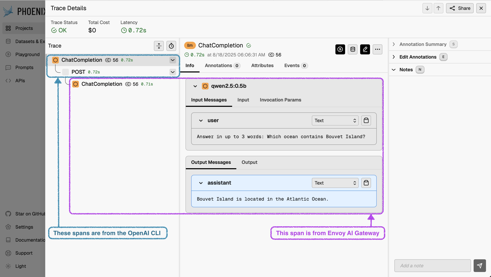

Aggregated metrics like latency, error rates, and throughput on their own won't reveal the source of _why_ a system's output was wrong, slow, or expensive.

The **v0.3 release** of Envoy AI Gateway brings comprehensive **OpenTelemetry tracing support** with **OpenInference semantic conventions**, extending the existing metrics foundation to provide complete visibility into LLM application behavior.

This enables you to improve the quality and safety of your AI-integrated applications by allowing you to understand the full context of a request journey, as your LLM traces will inform application improvements and guardrail needs.

<!-- truncate -->

## The Observability Challenges in AI Applications

Traditional observability looks at request speed, request volume, and error rates. These work well for simple stateless HTTP services. But they are not enough for AI applications.

**AI applications present unique challenges:**

- LLM requests have complicated costs based on token usage
- Responses can vary and may stream out tokens slowly
- Semantic failures occur when the AI fails to understand or produce the correct answer
- These issues don't show up as HTTP errors

Envoy AI Gateway has addressed some of these challenges. It collects a set of robust metrics through OpenTelemetry. It tracks token use, request times, and provider performance data.

The **v0.1.3 update** added GenAI-specific metrics. These include time-to-first-token, available via Prometheus endpoints.

However, these metrics alone can't tell you the full story or the root cause of an issue; this is where **OpenTelemetry tracing with OpenInference conventions** comes in.

## Specifications Made for AI: OpenInference Semantic Conventions

To enable you to gain traffic insights in the best way, Envoy AI Gateway chooses to stay close to standards. Instead of creating custom trace formats, Envoy AI Gateway uses **[OpenInference.](https://github.com/Arize-ai/openinference/blob/main/spec/semantic_conventions.md)** This is a widely accepted standard for AI applications, compatible with OpenTelemetry. Many frameworks, like **[BeeAI](https://docs.beeai.dev/observability/custom-agent-traceability)** and **[HuggingFace SmolAgents,](https://huggingface.co/docs/smolagents/v1.21.1/en/tutorials/inspect_runs#inspecting-runs-with-opentelemetry)** support it. OpenInference sets rules for tracking how large language models work. It covers things like the prompt, model settings, tokens used, and the response. Key moments, such as the time to get the first token during streaming, are recorded as span events. These relate to the earlier discussed metrics.

This OpenTelemetry approach uses spans and works well with common tracing systems. These systems usually link traces, not logs. For example, you can set up Envoy AI Gateway to **[work with Jaeger.](https://www.jaegertracing.io)** This setup is similar to how LLM evaluation systems like Arize Phoenix handle OpenInference directly. Redaction controls are available from the start. They help you manage your trace data and balance it with your evaluation needs.

**Redaction controls** are available from the start. They help you manage your trace data and balance it with your evaluation needs.

## How it All Fits Together: Envoy AI Gateway OpenTelemetry Tracing Architecture

Here's an example of a simple trace that includes both application and gateway spans, shown in Arize Phoenix:

## Capture and Evaluate your Traffic: LLM Evaluation

Tracing data isn't only for in-the-moment troubleshooting; this data is your key to optimizing your AI system.

**OpenInference traces provide the structured data foundation necessary for comprehensive LLM evaluation:**

- Capture the whole interaction context, including prompts, model parameters, and outputs
- Leverage evaluation frameworks to identify patterns over time
- Find optimization opportunities for performance, accuracy, and/or cost

### Evaluation Patterns

To analyze the trace data, you can leverage an **[LLM-as-a-Judge](https://arize.com/llm-as-a-judge/)** evaluation pattern using your production trace data.

Since your traces are in OpenInference format, your easiest option is to leverage a solution that can consume them. Platforms like **Arize Phoenix** consume OpenInference traces directly, enabling easy analysis of inference traffic captured through Envoy AI Gateway.

### Privacy Controls

When capturing tracing data, you want to ensure you keep private data private. The gateway includes **configurable privacy controls** for sensitive environments:

- Selectively redact content from spans
- Limit data captured in multimodal interactions
- Apply custom filtering based on organizational requirements

## Telemetry via the Gateway: Zero-Application-Change Integration

**Gateway-level tracing requires no code changes in your applications.** As traffic is routed via Envoy AI Gateway, the OpenInference-compliant traces are automatically created for all requests to the OpenAI-compatible API. This happens regardless of whether the calling applications include OpenTelemetry instrumentation.

### Automatic Trace Propagation

If your calling applications are already instrumented with OpenTelemetry, the client spans will automatically join the same distributed trace as the gateway spans, providing **end-to-end visibility**. This trace propagation offers a complete view of the AI interactions.

### Seamless Integration

As it integrates with your current tools, you and your team can begin using this new feature without needing to learn and adopt new tooling and instrumentation patterns.

## Follow the Development Lifecycle: Deployment Flexibility

As you move from local development, through dev, test, staging, and to production, you can capture and trace traffic in the same way.

**The tracing capability works consistently across deployment modes:**

- **Local development:** Standalone CLI tool
- **Production:** Kubernetes Gateway
- **All environments:** Full tracing support for OpenAI-compatible requests, including streaming responses and multimodal inputs

This deployment consistency simplifies your observability integration throughout your development lifecycle. Teams can establish observability patterns during local development that integrate seamlessly into production environments without architectural changes.

## Looking Ahead: AI Applications Evolve Fast, and Infrastructure and Observability with it

The new tracing capability is available with the **v0.3 Envoy AI Gateway release**. For complete configuration details and integration examples, see the **[tracing documentation](/docs/capabilities/observability/tracing)** to get started.

As AI infrastructure continues to evolve, comprehensive observability becomes essential for managing operational complexity and ensuring application quality. **OpenTelemetry tracing with OpenInference conventions** provides the foundation teams need to build reliable, observable AI systems.

### Get Involved

Want to get involved in building Envoy AI Gateway and further improve the observability capabilities?

- **Raise an issue** on our GitHub repository
- **Join us on Slack** in the `#envoy-ai-gateway` channel
- **Join our weekly community meetings**
