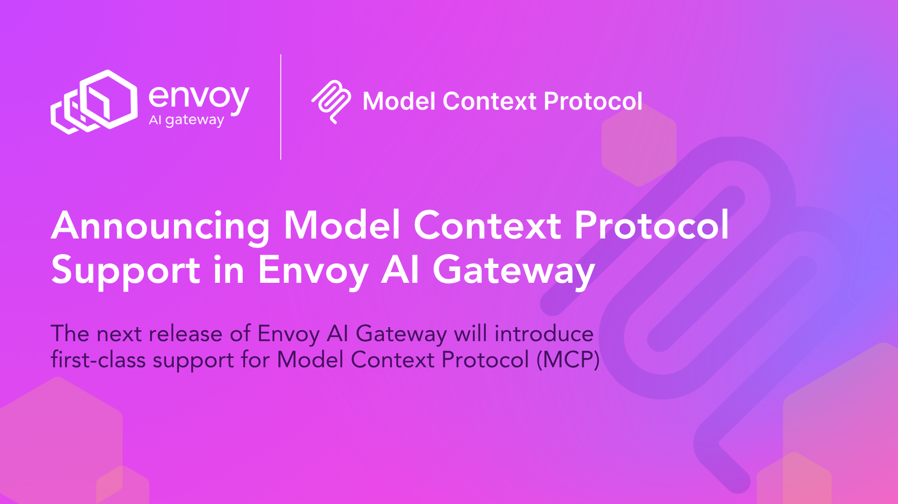

# Announcing Model Context Protocol Support in Envoy AI Gateway

We’re excited to announce that the next release of Envoy AI Gateway will introduce first-class support for [Model Context Protocol](https://modelcontextprotocol.io/) (MCP), cementing Envoy AI Gateway (EAIGW) as the universal gateway for modern production AI workloads.

Envoy AI Gateway started in close collaboration with [Bloomberg](https://www.bloomberg.com/) and [Tetrate](https://tetrate.io/) to meet production-scale AI workload demands, combining real-world expertise and innovation from some of the industry’s largest adopters. Built upon the battle-tested [Envoy Proxy](https://www.envoyproxy.io/) data plane as the AI extension of Envoy Gateway, it is trusted for critical workloads by thousands of enterprises worldwide. EAIGW already provides unified LLM access, cost and quota enforcement, credential management, intelligent routing, resiliency, and robust observability for mission-critical AI traffic.

With the addition of MCP, we have brought these features to the communication between Agents and external tools, making EAIGW even more versatile for enterprise-scale AI deployments. For a deeper look at the collaborative story and technical vision, see the [Bloomberg partnership announcement](https://tetrate.io/blog/tetrate-bloomberg-collaborating-on-envoy-ai-gateway), their [official release coverage](https://www.bloomberg.com/company/press/tetrate-and-bloomberg-release-open-source-envoy-ai-gateway-built-on-cncfs-envoy-gateway-project/), and previous [project announcements](/blog/01-release-announcement).

<!-- truncate -->

## Why MCP Matters for AI Gateways

MCP is rapidly becoming the industry’s open standard for enabling AI agents to securely and flexibly connect to external tools and data sources. As the AI ecosystem shifts from monolithic models to agentic architectures, **building robust, policy-driven, and observable pathways between AI and the rest of the enterprise stack has never been more critical**. Integrating MCP directly into Envoy AI Gateway means:

- **Seamless interoperability** between AI agents, tools, and context providers, whether they’re third-party cloud LLMs or internal enterprise services.
- **Consistent security and governance**: The gateway can now apply fine-grained authentication, authorization, and observability over tool invocations and data access flowing through MCP.
- **Accelerated developmen**t: With MCP supported natively, teams can adopt the latest agent-based AI flows **on their existing Envoy infrastructure without custom or glue code.**

## Key Features in the First Implementation

The initial implementation aims for a reliable implementation of the latest version of the spec, covering the full spectrum of features, not only focusing on tool calling:

| **Feature**                                              | **Description**                                                                                                                                                                                                                                                                                                                                                                                                                    |
| -------------------------------------------------------- | ---------------------------------------------------------------------------------------------------------------------------------------------------------------------------------------------------------------------------------------------------------------------------------------------------------------------------------------------------------------------------------------------------------------------------------- |
| **Streamable HTTP Transport**                            | Full support for MCP’s streamable HTTP transport, aligning with the [June 2025 MCP spec](https://modelcontextprotocol.io/specification/2025-06-18).<br/>Efficient handling of stateful sessions and multi-part JSON-RPC messaging over persistent HTTP connections.                                                                                                                                                                |
| **OAuth Authorization**                                  | Native enforcement of [OAuth authentication flows](https://modelcontextprotocol.io/specification/2025-06-18/basic/authorization) for AI agents and services bridging via MCP, ensuring secure tool usage at scale.<br/>Backwards compatibility with the [previous version of the authorization spec](https://modelcontextprotocol.io/specification/2025-03-26/basic/authorization) to maximize compatibility with existing agents. |
| **MCP Server multiplexing, Tool Routing, and Filtering** | Route tool calls and notifications to the right MCP backends, aggregating and filtering available tools based on gateway policy.<br/>Dynamically aggregate, merge, and filter messages and streaming notifications from multiple MCP servers, so agents receive a unified, policy-governed interface to all available services.                                                                                                    |
| **Upstream Authentication**                              | Built-in upstream authentication primitives to securely connect to external MCP servers, with support for credential injection and validation using existing Envoy Gateway patterns.                                                                                                                                                                                                                                               |
| **Full MCP Spec Coverage**                               | Complete [June 2025 MCP spec](https://modelcontextprotocol.io/specification/2025-06-18) compliance, including support for tool calls, notifications, prompts, resources, and bi-directional server-to-client requests.<br/>Robust session and stream management, including reconnection logic (e.g., Last-Event-ID for SSE), ensuring resilience and correctness for long-lived agent conversations.                               |
| **Zero Friction Developer and Production UX**            | All features are supported in standalone mode, allowing them to start the Envoy AI Gateway locally on their machine with a single command and start leveraging all MCP features. These configurations can be used as-is in production environments, as there is full compatibility between local standalone mode and Kubernetes.                                                                                                   |
| **Tested in Real Life**                                  | The implementation has full protocol test coverage and is tested with real-world providers like GitHub and agents like [Goose](https://block.github.io/goose/), validating end-to-end functionality in the existing ecosystem.                                                                                                                                                                                                     |

## Under the Hood

Adding MCP support meant more than just passing bytes through the stack. Our approach **leverages Envoy’s architecture and existing features**, introducing a lightweight MCP Proxy that handles session management, multiplexes streams, and bridges the gap between the stateful JSON-RPC protocol and the broader Envoy extension mechanisms.

Key design decisions included:

- **Minimal Architectural Complexity**: The implementation does not add any additional component/complexity to the existing Envoy AI Gateway’s architecture
- **Fully leverages Envoy's networking stack**: The MCP proxy harnesses Envoy’s proven networking stack for connection management, load balancing, circuit breaking, rate-limiting, observability, etc.
- **Decoupled Iteration Velocity**: The MCP Proxy is implemented as a lightweight Go server to keep pace with the rapidly evolving MCP specification, while still relying on Envoy for networking primitives.

:::info
You can find more details about the architecture and design decisions in the design document of the [MCP contribution pull request](https://github.com/envoyproxy/ai-gateway/pull/1260).
:::

## Getting Started

One of the easiest ways to get started with the MCP features in Envoy AI Gateway is by using the standalone mode to run it on your machine with no friction. In standalone mode, you can start the MCP Gateway with your existing MCP servers configuration file used by agents like Claude Code.

### Use your existing MCP servers file

In the following example, we’ll start Envoy AI Gateway to proxy the GitHub and Context7 MCP servers. First, define the servers in the mcp-servers.json file:

```json
{
  "mcpServers": {
    "context7": {
      "type": "http",
      "url": "https://mcp.context7.com/mcp"
    },
    "github": {
      "type": "http",
      "url": "https://api.githubcopilot.com/mcp/readonly",
      "headers": {
        "Authorization": "Bearer ${GITHUB_ACCESS_TOKEN}"
      }
    }
  }
}
```

And then start Envoy AI Gateway:

:::tip
Refer to the [CLI installation instructions](/docs/cli/aigwinstall) if you haven’t installed the CLI yet.
:::

```shell
$ aigw run --mcp-config mcp-servers.json
```

This will start the Envoy AI Gateway locally and start serving the MCP servers at [http://localhost:1975/mcp](http://localhost:1975/mcp).<br/>
**You can point your preferred agent (Claude, Goose, etc) to this URL as a Streamable HTTP MCP server.**

You can also use some features, like Tool Filtering, with the existing server file. To do it, you just need to add the list of tools to expose for each server (by default, all tools are exposed), like in the following example:

```json
{
  "mcpServers": {
    "context7": {
      "type": "http",
      "url": "https://mcp.context7.com/mcp"
    },
    "github": {
      "type": "http",
      "url": "https://api.githubcopilot.com/mcp/readonly",
      "headers": {
        "Authorization": "Bearer ${GITHUB_ACCESS_TOKEN}"
      },
      "tools": ["get_issue", "list_issues"]
    }
  }
}
```

### Using the new MCPRoute API

You can also use the new `MCPRoute` API, which will allow a more fine-grained configuration and will work in standalone mode and in Kubernetes as well.

The following example defines a complete `MCPRoute` that shows how simple it is to configure:

- MCP Server multiplexing.
- MCP Authentication using OAuth.
- Tool filtering.
- MCP Server upstream authentication.

```yaml
apiVersion: aigateway.envoyproxy.io/v1alpha1
kind: MCPRoute
metadata:
  name: mcp-route
  namespace: default
spec:
  parentRefs:
    - name: aigw-run
      kind: Gateway
      group: gateway.networking.k8s.io
  backendRefs:
    - name: context7
      kind: Backend
      group: gateway.envoyproxy.io
      path: "/mcp"
    - name: github
      kind: Backend
      group: gateway.envoyproxy.io
      path: "/mcp/readonly" # Use the radonly endpoint
      # Only expose certain tools
      toolSelector:
        includeRegex:
          - .*pull_requests?.*
          - .*issues?.*
      # Configure upstream authentication
      securityPolicy:
        apiKey:
          secretRef:
            name: github-access-token
  # Configure the gateway to enforce authentication using OAuth.
  securityPolicy:
    oauth:
      issuer: "https://auth-server.example.com"
      protectedResourceMetadata:
        # The URL here must match the URL of the Envoy AI Gateway
        resource: "http://localhost:1975/mcp"
        scopesSupported:
          - "profile"
          - "email"
```

This file can be used in your Kubernetes cluster and in standalone mode. You can quickly try it out with:

```shell
$ aigw run mcp-route.yaml
```

And point your local agents again to [http://localhost:1975/mcp](http://localhost:1975/mcp).<br/>
Once you’re happy with the configuration, you can apply it as-is on your Kubernetes cluster and production environments.

## What’s Next?

This is just the beginning. As MCP and agentic architectures advance, we’ll continue to evolve and upstream features—ensuring Envoy AI Gateway remains the **universal,** **most reliable, policy-driven, and interoperable AI gateway available** modern production AI workloads.

We are proud to contribute the implementation of the MCP protocol, and look forward to continue enhancing Envoy AI Gateway together with the community and bring more use cases and features to the project.

We’d love your feedback as you start exploring MCP in your GenAI or agent infrastructure. Join our community meetings or file an issue to help shape the roadmap\!
