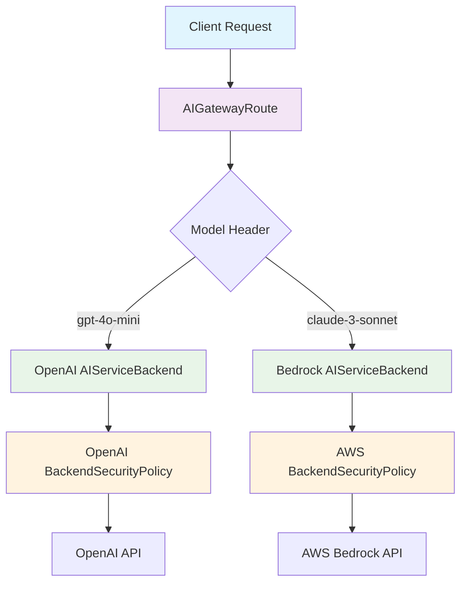

# Connecting to AI Providers

Envoy AI Gateway provides a unified interface for connecting to multiple AI providers through a standardized configuration approach. This page explains the fundamental concepts, resources, and relationships required to establish connectivity with any supported AI provider.

## Overview

Establishing connectivity with an AI provider involves configuring three key Kubernetes resources that work together to enable secure, scalable access to AI services:

1. **AIServiceBackend** - Defines the backend service and its API schema
2. **BackendSecurityPolicy** - Configures authentication credentials
3. **AIGatewayRoute** - Routes client requests to the appropriate backends

These resources provide a consistent configuration model regardless of which AI provider you're connecting to, whether it's OpenAI, AWS Bedrock, Azure OpenAI, or any other [supported provider](./supported-providers).

## Core Resources for Provider Connectivity

### AIServiceBackend

The `AIServiceBackend` resource represents an individual AI service backend and serves as the bridge between your gateway and the AI provider's API.

#### Purpose and Configuration

- **API Schema Definition**: Specifies which API format the backend expects (OpenAI v1, AWS Bedrock, Azure OpenAI, etc.)
- **Backend Reference**: Points to the Envoy Gateway Backend resource
- **Security Integration**: Links to authentication policies for upstream services

#### Key Fields

```yaml
apiVersion: aigateway.envoyproxy.io/v1alpha1
kind: AIServiceBackend
metadata:
  name: my-provider-backend
spec:
  # API schema the backend expects
  schema:
    name: OpenAI # Provider API format
    version: "v1" # API version (optional for OpenAI, defaults to "v1")

  # Reference to the Envoy Gateway Backend resource
  backendRef:
    name: my-provider-backend
    kind: Backend
    group: gateway.envoyproxy.io
```

#### Schema Configuration Examples

Different providers require different schema configurations:

| Provider                   | Schema Configuration                                      |
| -------------------------- | --------------------------------------------------------- |
| OpenAI                     | `{"name":"OpenAI","version":"v1"}`                        |
| AWS Bedrock                | `{"name":"AWSBedrock"}`                                   |
| Azure OpenAI               | `{"name":"AzureOpenAI","version":"2025-01-01-preview"}`   |
| GCP Vertex AI              | `{"name":"GCPVertexAI"}`                                  |
| GCP Anthropic on Vertex AI | `{"name":"GCPAnthropic", "version": "vertex-2023-10-16"}` |

:::tip
Many providers offer OpenAI-compatible APIs, which allows them to use the OpenAI schema configuration with provider-specific version paths.
:::

### BackendSecurityPolicy

The `BackendSecurityPolicy` resource configures authentication credentials needed to access upstream AI services securely.

#### Purpose and Configuration

- **Credential Management**: Stores API keys, cloud credentials, or other authentication mechanisms
- **Security Isolation**: Keeps sensitive credentials separate from routing configuration
- **Provider Flexibility**: Supports multiple authentication types for different providers

#### Authentication Types

##### API Key Authentication

Commonly used across many providers

```yaml
apiVersion: aigateway.envoyproxy.io/v1alpha1
kind: BackendSecurityPolicy
metadata:
  name: openai-auth
spec:
  type: APIKey
  apiKey:
    secretRef:
      name: openai-secret
      namespace: default
```

:::note
The secret must contain the API key with the key name `"apiKey"`.
:::

##### AWS Credentials

Used when connecting to AWS Bedrock. Supports three authentication methods:

**Option 1: EKS Pod Identity or IRSA (Recommended for production)**

When running on EKS, the AWS SDK automatically uses the default credential chain, which includes EKS Pod Identity and IRSA. Simply configure the region:

```yaml
apiVersion: aigateway.envoyproxy.io/v1alpha1
kind: BackendSecurityPolicy
metadata:
  name: bedrock-auth
spec:
  type: AWSCredentials
  awsCredentials:
    region: us-east-1
    # No credentialsFile needed - automatically uses:
    # - EKS Pod Identity (if Pod Identity association exists)
    # - IRSA (if ServiceAccount has eks.amazonaws.com/role-arn annotation)
```

See the [Connect AWS Bedrock guide](../../getting-started/connect-providers/aws-bedrock.md) for detailed setup instructions.

**Option 2: Static Credentials (Development/Testing)**

```yaml
apiVersion: aigateway.envoyproxy.io/v1alpha1
kind: BackendSecurityPolicy
metadata:
  name: bedrock-auth
spec:
  type: AWSCredentials
  awsCredentials:
    region: us-east-1
    credentialsFile:
      secretRef:
        name: aws-secret
        namespace: default
      profile: default # Optional, defaults to "default"
```

:::note
When using static credentials, the secret must contain the AWS credentials file with the key name `"credentials"`.
:::

##### Azure Credentials

Used for connecting to Azure OpenAI

```yaml
apiVersion: aigateway.envoyproxy.io/v1alpha1
kind: BackendSecurityPolicy
metadata:
  name: azure-auth
spec:
  type: AzureCredentials
  azureCredentials:
    clientID: "your-azure-client-id"
    tenantID: "your-azure-tenant-id"
    clientSecretRef:
      name: azure-secret
      namespace: default
```

:::note
The secret must contain the Azure client secret with the key name `"client-secret"`.
:::

##### GCP Credentials

Used for connecting to GCP Vertex AI and Anthropic on GCP

1. Service Account Key Files:
   A service account key file is a JSON file containing a private key that authenticates as a service account.
   You create a service account in GCP, generate a key file, download it, and then store it in the k8s secret referenced by BackendSecurityPolicy.
   Envoy AI Gateway uses this key file to generate an access token and authenticate with GCP Vertex AI.

```yaml
apiVersion: aigateway.envoyproxy.io/v1alpha1
kind: BackendSecurityPolicy
metadata:
  name: gcp-auth-service-account-key
  namespace: default
spec:
  type: GCPCredentials
  gcpCredentials:
    projectName: GCP_PROJECT_NAME # Replace with your GCP project name
    region: GCP_REGION # Replace with your GCP region
    credentialsFile:
      secretRef:
        name: envoy-ai-gateway-basic-gcp-service-account-key-file
```

2. Workload Identity Federation:
   Workload Identity Federation is a modern, keyless authentication method that allows workloads running outside of GCP to impersonate a service account using their own native identity.
   It leverages a trust relationship between GCP and an external identity provider such as OIDC.

```yaml
apiVersion: aigateway.envoyproxy.io/v1alpha1
kind: BackendSecurityPolicy
metadata:
  name: gcp-auth
spec:
  type: GCPCredentials
  gcpCredentials:
    projectName: "your-gcp-project"
    region: "us-central1"
    workloadIdentityFederationConfig:
      projectID: "your-gcp-project-id"
      workloadIdentityPoolName: "your-workload-identity-pool"
      workloadIdentityProviderName: "your-identity-provider"
      serviceAccountImpersonation:
        serviceAccountName: "your-service-account"
      oidcExchangeToken:
        oidc:
          provider:
            issuer: "https://your-oidc-provider.com"
          clientID: "your-oidc-client-id"
          clientSecret:
            name: "gcp-client-secret"
            namespace: default
```

#### Security Best Practices

- **Store credentials in Kubernetes Secrets**: Never expose sensitive data in plain text
- **Use principle of least privilege**: Grant only necessary permissions
- **Rotate credentials regularly**: Implement credential rotation policies
- **Separate environments**: Use different credentials for development, staging, and production

### AIGatewayRoute

The `AIGatewayRoute` resource defines how client requests are routed to appropriate AI backends and manages the unified API interface.

#### Purpose and Configuration

- **Request Routing**: Directs traffic to specific backends based on model names or other criteria
- **API Unification**: Provides a consistent interface regardless of backend provider
- **Request Transformation**: Automatically converts between different API schemas
- **Load Balancing**: Distributes traffic across multiple backends

#### Basic Configuration

```yaml
apiVersion: aigateway.envoyproxy.io/v1alpha1
kind: AIGatewayRoute
metadata:
  name: multi-provider-route
spec:
  # Gateway to attach to
  parentRefs:
    - name: my-gateway
      kind: Gateway
      group: gateway.networking.k8s.io

  # Routing rules
  rules:
    - matches:
        - headers:
            - type: Exact
              name: x-ai-eg-model
              value: gpt-4o-mini
      backendRefs:
        - name: openai-backend
    - matches:
        - headers:
            - type: Exact
              name: x-ai-eg-model
              value: claude-3-sonnet
      backendRefs:
        - name: bedrock-backend
```

## Resource Relationships and Data Flow

Understanding how these resources work together is crucial for successful provider connectivity:



### Data Flow Process

1. **Request Reception**: Client sends a request to the AI Gateway with the OpenAI-compatible format
2. **Route Matching**: AIGatewayRoute examines request headers (like `x-ai-eg-model`) to determine the target backend
3. **Backend Resolution**: The matching rule identifies the appropriate AIServiceBackend
4. **Authentication**: The AIServiceBackend's security policy provides credentials for upstream authentication
5. **Schema Transformation**: If needed, the request is transformed from the input schema to the backend's expected schema
6. **Provider Communication**: The request is forwarded to the actual AI provider with proper authentication
7. **Response Processing**: The provider's response is transformed back to the unified schema format
8. **Client Response**: The standardized response is returned to the client

## Common Configuration Patterns

### Single Provider Setup

For a simple single-provider setup:

```yaml
# Backend configuration
apiVersion: aigateway.envoyproxy.io/v1alpha1
kind: AIServiceBackend
metadata:
  name: openai-backend
spec:
  schema:
    name: OpenAI
    version: v1
  backendRef:
    name: openai-backend
    kind: Backend
    group: gateway.envoyproxy.io

---
# Security configuration
apiVersion: aigateway.envoyproxy.io/v1alpha1
kind: BackendSecurityPolicy
metadata:
  name: openai-auth
spec:
  targetRefs:
    - group: aigateway.envoyproxy.io
      kind: AIServiceBackend
      name: openai-backend
  type: APIKey
  apiKey:
    secretRef:
      name: openai-secret
      namespace: default

---
# Routing configuration
apiVersion: aigateway.envoyproxy.io/v1alpha1
kind: AIGatewayRoute
metadata:
  name: openai-route
spec:
  parentRefs:
    - name: my-gateway
      kind: Gateway
      group: gateway.networking.k8s.io
  rules:
    - backendRefs:
        - name: openai-backend
```

### Multi-Provider Setup with Fallback

For high availability with multiple providers:

```yaml
apiVersion: aigateway.envoyproxy.io/v1alpha1
kind: AIGatewayRoute
metadata:
  name: multi-provider-fallback
spec:
  parentRefs:
    - name: my-gateway
      kind: Gateway
      group: gateway.networking.k8s.io
  rules:
    - matches:
        - headers:
            - type: Exact
              name: x-ai-eg-model
              value: gpt-4o-mini
      backendRefs:
        - name: openai-backend
        - name: groq-backend # Fallback provider
```

### Model-Specific Routing

For routing different models to specialized providers:

```yaml
apiVersion: aigateway.envoyproxy.io/v1alpha1
kind: AIGatewayRoute
metadata:
  name: model-specific-routing
spec:
  parentRefs:
    - name: my-gateway
      kind: Gateway
      group: gateway.networking.k8s.io
  rules:
    - matches:
        - headers:
            - type: Exact
              name: x-ai-eg-model
              value: gpt-4o-mini
      backendRefs:
        - name: openai-backend
    - matches:
        - headers:
            - type: Exact
              name: x-ai-eg-model
              value: claude-3-sonnet
      backendRefs:
        - name: bedrock-backend
    - matches:
        - headers:
            - type: Exact
              name: x-ai-eg-model
              value: text-embedding-ada-002
      backendRefs:
        - name: openai-embeddings-backend
```

Configure model ownership and creation information for the `/models` endpoint:

```yaml
apiVersion: aigateway.envoyproxy.io/v1alpha1
kind: AIGatewayRoute
metadata:
  name: model-metadata
spec:
  parentRefs:
    - name: my-gateway
      kind: Gateway
      group: gateway.networking.k8s.io
  rules:
    - matches:
        - headers:
            - type: Exact
              name: x-ai-eg-model
              value: gpt-4o-mini
      modelsOwnedBy: "OpenAI"
      modelsCreatedAt: "2024-01-01T00:00:00Z"
      backendRefs:
        - name: openai-backend
```

## Provider-Specific Considerations

### OpenAI-Compatible Providers

Many providers offer OpenAI-compatible APIs:

- Use OpenAI schema configuration
- Adjust the version field if the provider uses custom paths
- Standard API key authentication typically applies

### Cloud Provider Integration

Cloud providers like AWS Bedrock and Azure OpenAI require:

- Cloud-specific credential types (AWS IAM, Azure Service Principal, GCP Workload Identity)
- Region specification for multi-region services
- Custom schema configurations for native APIs

### Self-Hosted Models

Self-hosted models using frameworks like vLLM:

- Often compatible with OpenAI schema
- May not require authentication (internal networks)
- Custom endpoints through Envoy Gateway Backend resources

## Validation and Troubleshooting

### Configuration Validation

The AI Gateway validates configurations at deployment time:

- **Schema Compatibility**: Ensures input and output schemas are compatible
- **Resource References**: Validates that referenced resources exist
- **Credential Access**: Verifies that secrets are accessible

### Status Conditions

All resources provide status conditions to monitor their health:

- **Accepted**: Resource is valid and has been accepted by the controller
- **NotAccepted**: Resource has validation errors or configuration issues

### Common Issues and Solutions

**Authentication Failures (401/403)**

- Verify API keys and credentials are correct
- Check secret references and key names
- Ensure credentials have necessary permissions

**Schema Mismatch Errors**

- Confirm the backend schema matches the provider's API
- Check version specifications for provider-specific paths
- Review API documentation for schema requirements

**Routing Issues**

- Verify header matching rules in AIGatewayRoute
- Check that model names match expected values
- Ensure backend references point to existing AIServiceBackends

**Backend Reference Errors**

- Ensure backendRef points to Envoy Gateway Backend resources
- Verify the Backend resource exists and is properly configured
- Check that the group field is set to `gateway.envoyproxy.io`

## Next Steps

Now that you understand the connectivity fundamentals:

- **[Supported Providers](/docs/capabilities/llm-integrations/supported-providers)** - View the complete list of supported providers and their configurations
- **[Supported Endpoints](/docs/capabilities/llm-integrations/supported-endpoints)** - Learn about available API endpoints and their capabilities
- **[Getting Started Guide](/docs/getting-started/connect-providers)** - Follow hands-on tutorials for specific providers
- **[Traffic Management](/docs/capabilities/traffic)** - Configure advanced routing, rate limiting, and fallback strategies
- **[Security](/docs/capabilities/security)** - Implement comprehensive security policies for your AI traffic

## API Reference

For detailed information about resource fields and configuration options:

- [AIServiceBackend API Reference](../../api/api.mdx#aiservicebackend)
- [BackendSecurityPolicy API Reference](../../api/api.mdx#backendsecuritypolicy)
- [AIGatewayRoute API Reference](../../api/api.mdx#aigatewayroute)
