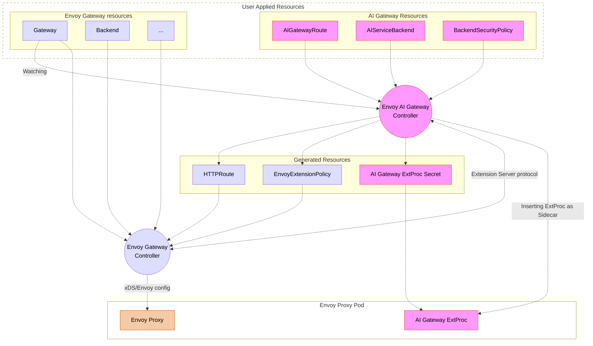

# Control Plane Explained

The control plane is responsible for configuring and managing the system. It consists of several key components working together to manage the AI Gateway configuration.

## How It Works

The control plane operates through a chain of components that work together to manage the configuration:

1. The Envoy AI Gateway controller watches AI Gateway Custom Resources (CRs)
2. When changes are detected, it updates/generates the Envoy Gateway configuration
3. The Envoy Gateway communicates with the Envoy AI Gateway controller via the [Envoy Gateway Extension server](https://gateway.envoyproxy.io/docs/tasks/extensibility/extension-server/) protocol, and the Envoy AI Gateway controller then fine-tunes the xDS configuration before the Envoy Gateway applies it to the Envoy Proxy.
4. The data plane (Envoy Proxy) processes AI traffic based on this configuration where the AI Gateway ExtProc runs as a sidecar to handle AI-specific processing. The sidecar container is inserted by the AI Gateway controller into the Envoy Proxy Pod.

This architecture ensures a clear separation of concerns, where the AI Gateway controller focuses on AI-specific configuration while leveraging Envoy Gateway for general proxy management.

## Components

### 1. Envoy AI Gateway Controller
The AI Gateway Controller manages AI-specific components and configurations:

#### ExtProc Management
- Creates and updates ExtProc Secrets with processing rules as well as credentials
- Inserts the AI Gateway ExtProc as a sidecar container in the Envoy Proxy Pod via the [Kubernetes Admission Webhooks](https://kubernetes.io/docs/reference/access-authn-authz/extensible-admission-controllers/). The container mounts the ExtProc config secret and communicates with the Envoy Proxy to process AI traffic.

#### Resource Management
- Watches AI Gateway Custom Resources (CRs)
- Creates and manages `HTTPRoute` and `EnvoyExtensionPolicy` resources
- Manages backend security policies and authentication, including the credentials rotation

#### Integration with Envoy Gateway
- Works alongside Envoy Gateway Controller (not directly configuring Envoy)
- Creates resources, such as `HTTPRoute`, that Envoy Gateway translates into Envoy configuration with AI-specific processing rules
- Serves the [Envoy Gateway Extension Server](https://gateway.envoyproxy.io/docs/tasks/extensibility/extension-server/) to fine-tune the Envoy configuration (xDS)
- Enables token-based rate limiting through metadata

### 2. Envoy Gateway Controller
- Manages the core Envoy configuration through xDS
- Handles service discovery and load balancing
- Manages TLS certificates
- Translates Gateway API resources into Envoy configuration

## Next Steps

To learn more:
- Understand the [Data Plane and Traffic Flow](./data-plane.md)
