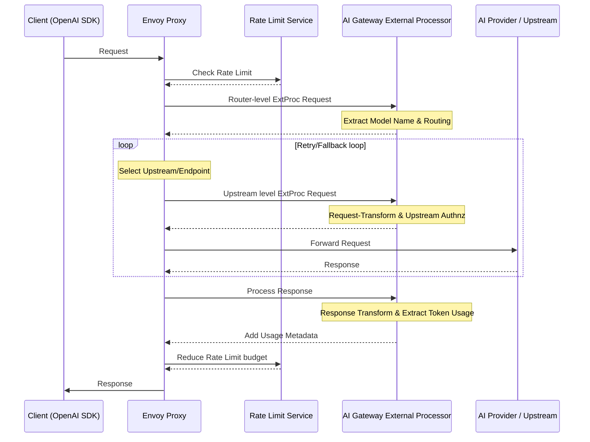

# Data Plane and Traffic Flow

The data plane handles the actual request traffic, with the External Processor (ExtProc) playing a central role in managing AI-specific processing.

## Components

The data plane consists of several key components:

### 1. Envoy Proxy
The core proxy that handles all incoming traffic and integrates with:
- External Processor for AI-specific processing
- Rate Limit Service for token-based rate limiting
- Various AI providers as backends

### 2. AI Gateway External Processor
A specialized extension service of Envoy Proxy that handles AI-specific processing needs. It performs three main functions:

1. **Request Processing**
   - Routes requests to appropriate AI providers
   - Handles model selection and validation
   - Manages provider-specific authentication
   - Supports different API formats (OpenAI, AWS Bedrock)

2. **Token Management**
   - Tracks token usage from AI providers
   - Handles both streaming and non-streaming responses
   - Provides usage data for rate limiting decisions

3. **Provider Integration**
   - Transforms requests between different AI provider formats
   - Normalizes responses to a consistent format
   - Manages provider-specific requirements

### 3. Rate Limit Service
Handles token-based rate limiting by:
- Tracking token usage across requests
- Enforcing rate limits based on token consumption
- Managing rate limit budgets

## Request Processing Flow

The data plane processes requests through several key steps:

### 1. Request Path
1. **Routing**: Calculates the destination AI provider based on:
   - Request path
   - Headers
   - Model name extracted from the request body

2. **Request Transformation**: Prepares the request for the provider:
   - Request body transformation
   - Request path modification
   - Format adaptation

3. **Upstream Authorization**: Handles provider authentication:
   - API key management
   - Header modifications
   - Authentication token handling

4. **Token Rate Limiting Check**: Checks the request against the Rate Limit Service:
   - Validates token usage
   - Enforces rate limits based on configured budgets

### 2. Response Path
1. **Response Transformation**:
   - Transforms provider response for client compatibility
   - Normalizes response format
   - Handles streaming responses

2. **Token Usage Management**:
   - Extracts token usage from responses
   - Calculates usage based on configuration
   - Stores usage in per-request dynamic metadata
   - Enables rate limiting based on token consumption

## Next Steps

To learn more:
- Explore the [System Architecture](./system-architecture.md)
- Check out our [Getting Started](../../getting-started/index.md) guide for hands-on experience
