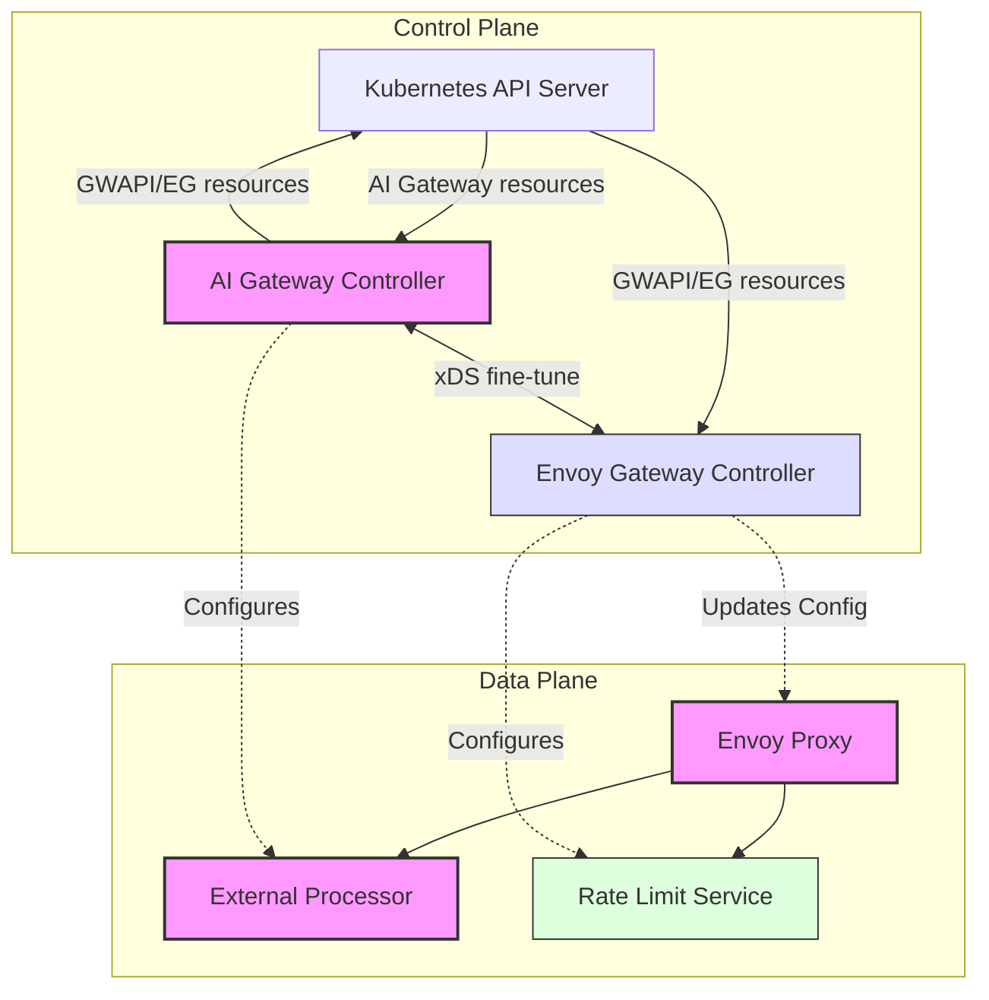

# System Architecture Overview

Envoy AI Gateway follows a modern cloud-native architecture pattern with distinct control and data planes. Let's explore how these components work together to manage AI traffic effectively.

The architecture is divided into two main planes:

1. **Control Plane**: Responsible for configuring and managing the system
   - Kubernetes API Server serves as the configuration interface
   - AI Gateway Controller manages AI-specific resources and configurations
   - Envoy Gateway Controller handles core proxy configuration and xDS

2. **Data Plane**: Handles the actual request traffic
   - Envoy Proxy and External Processor work together to handle AI traffic
   - Envoy Proxy routes and manages all incoming requests
   - External Processor handles AI-specific transformations and validations
   - Rate Limit Service manages token-based rate limiting

The Control Plane configures the Data Plane through several paths:
- AI Gateway Controller configures the External Processor as well as fine-tuning xDS configurations via Envoy Gateway extension server mechanism.
- Envoy Gateway Controller configures Envoy Proxy through xDS as well as Rate Limit Service.

For detailed information about specific components:
- Learn more about the [Control Plane](./control-plane.md) components
- Understand the [Data Plane](./data-plane.md) in detail
