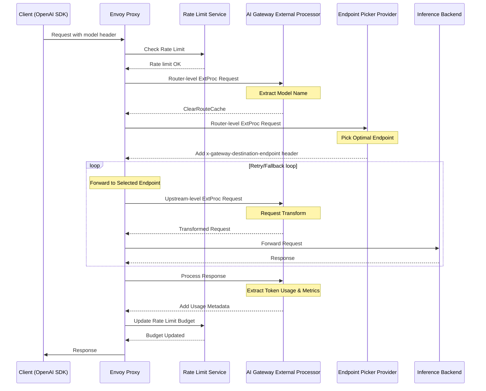
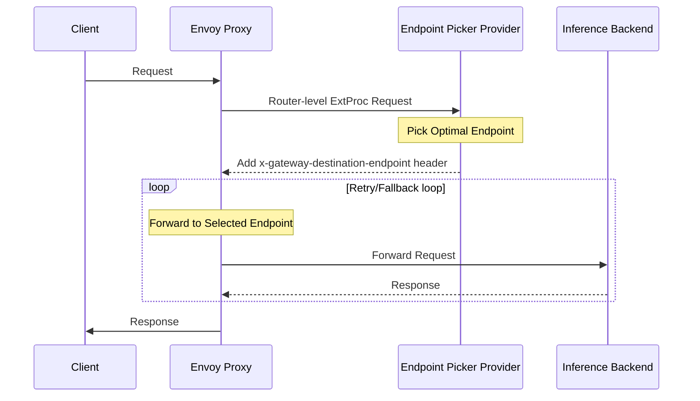

# InferencePool Support

InferencePool is a powerful feature that enables intelligent routing and load balancing for AI inference workloads. It integrates with the [Gateway API Inference Extension](https://gateway-api-inference-extension.sigs.k8s.io/) to provide dynamic endpoint selection based on real-time metrics and availability. Real-time metrics refer to data points such as KVCache Usage, Queued Inference Requests, LoRA Adapters info and etc, which are continuously monitored to make informed routing decisions.

## What is InferencePool?

InferencePool is a Kubernetes custom resource that defines a pool of inference endpoints and specifies how requests should be routed among them. It solves several key challenges in AI inference deployments:

- **Dynamic Load Balancing**: Automatically distribute requests across multiple inference instances
- **Intelligent Routing**: Route requests to the most suitable endpoints based on current load, latency, and more self-defined routing algorithms.
- **Automatic Failover**: Handle endpoint failures gracefully with built-in retry mechanisms
- **Resource Optimization**: Maximize utilization of inference compute resources

## Core Problems Solved

Traditional load balancing treats all backends equally, but inference workloads have unique characteristics:

- Variable processing times based on model complexity and input size
- Different resource requirements for different models
- Need for intelligent routing based on real-time metrics

## Request Flow

InferencePool supports two integration modes with different request flows:

### AIGatewayRoute + InferencePool Flow

### HTTPRoute + InferencePool Flow

## Integration Approaches

Envoy AI Gateway supports two ways to use InferencePool:

### 1. HTTPRoute + InferencePool

Direct integration with standard Gateway API HTTPRoute for simple inference routing scenarios.

**Use Cases:**

- Simple inference workloads without complex AI-specific requirements
- Direct OpenAI-compatible API forwarding

### 2. AIGatewayRoute + InferencePool

Enhanced integration with AI Gateway's custom route type for advanced AI-specific features.

**Use Cases:**

- Multi-model routing based on request content
- Token-based rate limiting
- Advanced observability and metrics
- Request/response transformation

## AIGatewayRoute Advantages

AIGatewayRoute provides several advantages over standard HTTPRoute when used with InferencePool:

### Advanced OpenAI Routing

- Built-in OpenAI API schema validation
- Seamless integration with OpenAI SDKs
- Route multiple models in a single listener
- Mix InferencePool and traditional backends
- Automatic model extraction from request body

### AI-Specific Features

- Token-based rate limiting
- Model performance metrics
- Cost tracking and management
- Request/response transformation

## Getting Started

To use InferencePool with Envoy AI Gateway, you'll need to:

1. **Install Prerequisites**:
   - Deploy Gateway API Inference Extension CRD.
   - Configure Envoy Gateway with the InferencePool support. See [Envoy Gateway Installation Guide](../../getting-started/prerequisites.md#additional-features-rate-limiting-inferencepool-etc) for details.
2. **Configure InferencePool**: Define your inference endpoints and selection criteria
3. **Set up Routes**: Configure either HTTPRoute or AIGatewayRoute to use the InferencePool
4. **Deploy Endpoint Picker**: Install and configure the endpoint picker provider

The following sections provide detailed guides for both integration approaches with complete examples and step-by-step instructions.
