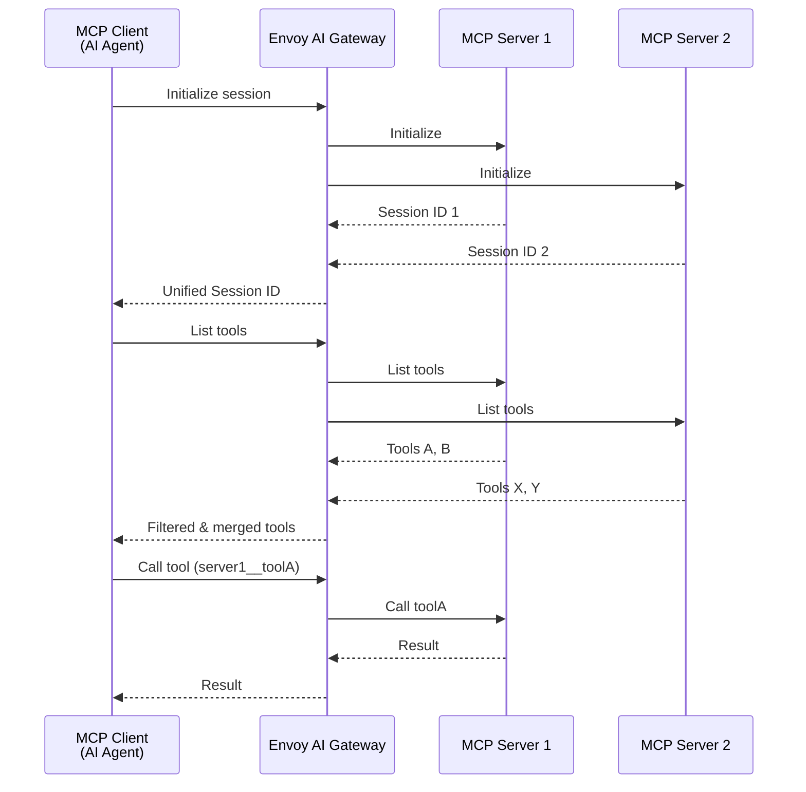
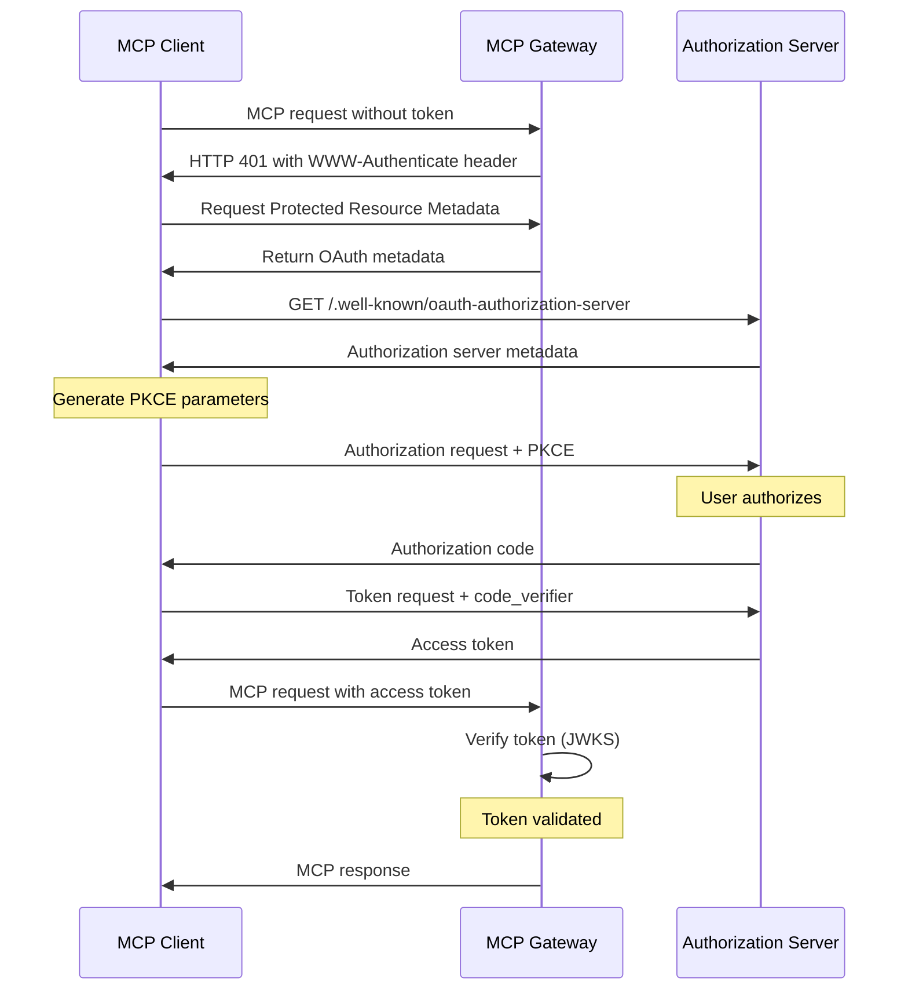

Envoy AI Gateway provides first-class support for [Model Context Protocol](https://modelcontextprotocol.io/) (MCP), enabling AI agents to securely connect to external tools and data sources.

This guide provides an overview of the MCP Gateway capabilities and how to configure routing to MCP servers using the `MCPRoute` API.

## Overview

Envoy AI Gateway's MCP support allows you to:

- **Aggregate multiple MCP servers** into a single unified endpoint
- **Apply security policies** including OAuth authentication and upstream API key injection
- **Filter tools** to control which capabilities are exposed to clients
- **Leverage Envoy's networking** for load balancing, rate limiting, circuit breaking, and observability

The MCP Gateway acts as a transparent proxy between MCP clients (AI agents like Claude, Goose, etc.) and backend MCP servers, providing the same production-grade features available for LLM traffic.

## Key Features

| Feature                                | Description                                                                                                                                                                                                                                                         |
| -------------------------------------- | ------------------------------------------------------------------------------------------------------------------------------------------------------------------------------------------------------------------------------------------------------------------- |
| **Streamable HTTP Transport**          | Full support for MCP's streamable HTTP transport, aligning with the [June 2025 MCP spec](https://modelcontextprotocol.io/specification/2025-06-18).<br/>Efficient handling of stateful sessions and multi-part JSON-RPC messaging over persistent HTTP connections. |
| **OAuth Authorization**                | Native enforcement of [OAuth authentication flows](https://modelcontextprotocol.io/specification/2025-06-18/basic/authorization) for AI agents and services bridging via MCP.                                                                                       |
| **Server Multiplexing & Tool Routing** | Route tool calls to the right MCP backends, aggregating and filtering available tools based on gateway policy.<br/>Dynamically merge streaming notifications from multiple MCP servers into a unified interface.                                                    |
| **Upstream Authentication**            | Built-in upstream authentication primitives to securely connect to external MCP servers using API keys and header injection.                                                                                                                                        |
| **Full MCP Spec Coverage**             | Complete [June 2025 MCP spec](https://modelcontextprotocol.io/specification/2025-06-18) compliance, including support for tool calls, notifications, prompts, resources, and bi-directional server-to-client requests.                                              |
| **Built-in Observability**             | OpenTelemetry tracing and Prometheus metrics for all MCP requests, using the same observability stack as LLM traffic.                                                                                                                                               |

## Architecture

The MCP Gateway is implemented as a lightweight proxy component within the Envoy AI Gateway sidecar, leveraging Envoy's battle-tested networking stack for all connection handling.



**Key architectural aspects:**

- **Session Management**: The gateway creates unified sessions by encoding multiple backend session IDs, handling reconnection with `Last-Event-ID` support for SSE streams.
- **Notification Handling**: Long-lived SSE streams from multiple MCP servers are merged into a single stream for clients, with proper event ID reconstruction.
- **Request Routing**: Tool names are automatically prefixed with the backend name (e.g., `github__issue_read`) to route calls to the correct upstream server.

For detailed architecture and design decisions, see the [MCP Gateway proposal](https://github.com/envoyproxy/ai-gateway/tree/v0.4.0/docs/proposals/006-mcp-gateway).

## Trying it out

Before you begin, you'll need to complete the basic setup from the [Basic Usage](/docs/getting-started/basic-usage) guide, which includes installing Envoy Gateway and AI Gateway.

### Basic MCPRoute Configuration

The following example demonstrates a basic `MCPRoute` that proxies the GitHub MCP server:

```yaml
apiVersion: aigateway.envoyproxy.io/v1alpha1
kind: MCPRoute
metadata:
  name: mcp-route
  namespace: default
spec:
  parentRefs:
    - name: aigw-run
      kind: Gateway
      group: gateway.networking.k8s.io
  path: "/mcp" # Clients connect to http://gateway-address/mcp
  backendRefs:
    - name: github
      kind: Backend
      group: gateway.envoyproxy.io
      path: "/mcp/x/issues/readonly"
      securityPolicy:
        apiKey:
          secretRef:
            name: github-token
---
apiVersion: gateway.envoyproxy.io/v1alpha1
kind: Backend
metadata:
  name: github
  namespace: default
spec:
  endpoints:
    - fqdn:
        hostname: api.githubcopilot.com
        port: 443
---
apiVersion: v1
kind: Secret
metadata:
  name: github-token
  namespace: default
type: Opaque
stringData:
  apiKey: ghp_your_token_here
```

Apply this configuration:

```shell
kubectl apply -f mcp-route.yaml
```

Now clients can connect to `http://<gateway-address>/mcp` and access GitHub tools.

### Tool Filtering

Control which tools are exposed using the `toolSelector` field. You can use exact matches or regular expressions:

```yaml
apiVersion: aigateway.envoyproxy.io/v1alpha1
kind: MCPRoute
metadata:
  name: mcp-route
  namespace: default
spec:
  parentRefs:
    - name: aigw-run
      kind: Gateway
      group: gateway.networking.k8s.io
  backendRefs:
    # GitHub: only expose issue-related tools
    - name: github
      kind: Backend
      group: gateway.envoyproxy.io
      path: "/mcp/x/issues/readonly"
      toolSelector:
        includeRegex:
          - .*issues?.* # Matches issue_read, list_issues, etc.
      securityPolicy:
        apiKey:
          secretRef:
            name: github-token

    # Context7: expose specific tools by exact name
    - name: context7
      kind: Backend
      group: gateway.envoyproxy.io
      path: "/mcp"
      toolSelector:
        include:
          - resolve-library-id
          - get-library-docs
```

:::note
The `toolSelector` field requires exactly one of `include` or `includeRegex` to be specified. If not specified, all tools from the MCP server are exposed.
:::

### Server Multiplexing

The gateway automatically aggregates tools from multiple MCP servers into a single unified interface:

```yaml
apiVersion: aigateway.envoyproxy.io/v1alpha1
kind: MCPRoute
metadata:
  name: mcp-unified
  namespace: default
spec:
  parentRefs:
    - name: aigw-run
      kind: Gateway
      group: gateway.networking.k8s.io
  path: "/mcp"
  backendRefs:
    - name: github
      kind: Backend
      group: gateway.envoyproxy.io
      path: "/mcp/x/issues/readonly"
      securityPolicy:
        apiKey:
          secretRef:
            name: github-token
    - name: context7
      kind: Backend
      group: gateway.envoyproxy.io
      path: "/mcp"
```

Clients will see all tools with prefixed names:

- `github__issue_read`
- `github__list_issues`
- `context7__resolve-library-id`
- `context7__get-library-docs`

### OAuth Authentication

Protect your MCP Gateway with OAuth authentication following the [MCP Authorization specification](https://modelcontextprotocol.io/specification/2025-06-18/basic/authorization):

```yaml
apiVersion: aigateway.envoyproxy.io/v1alpha1
kind: MCPRoute
metadata:
  name: mcp-route
  namespace: default
spec:
  parentRefs:
    - name: aigw-run
      kind: Gateway
      group: gateway.networking.k8s.io
  backendRefs:
    - name: github
      kind: Backend
      group: gateway.envoyproxy.io
      path: "/mcp/readonly"
  securityPolicy:
    oauth:
      issuer: "https://keycloak.example.com/realms/master"
      audiences:
        - "https://api.example.com/mcp"
      protectedResourceMetadata:
        resource: "https://api.example.com/mcp"
        scopesSupported:
          - "profile"
          - "email"
```

The OAuth flow follows the MCP specification's authorization code flow with PKCE:



## See Also

- [MCP Gateway Proposal](https://github.com/envoyproxy/ai-gateway/tree/v0.4.0/docs/proposals/006-mcp-gateway) - Detailed architecture and design decisions
- [MCP Specification](https://modelcontextprotocol.io/specification/2025-06-18) - Official Model Context Protocol documentation
- [MCP Example](https://github.com/envoyproxy/ai-gateway/tree/v0.4.0/examples/mcp) - Complete working example
- [CLI MCP Configuration](/docs/cli/aigwrun#mcp-configuration) - Using MCP with `aigw run` standalone mode
