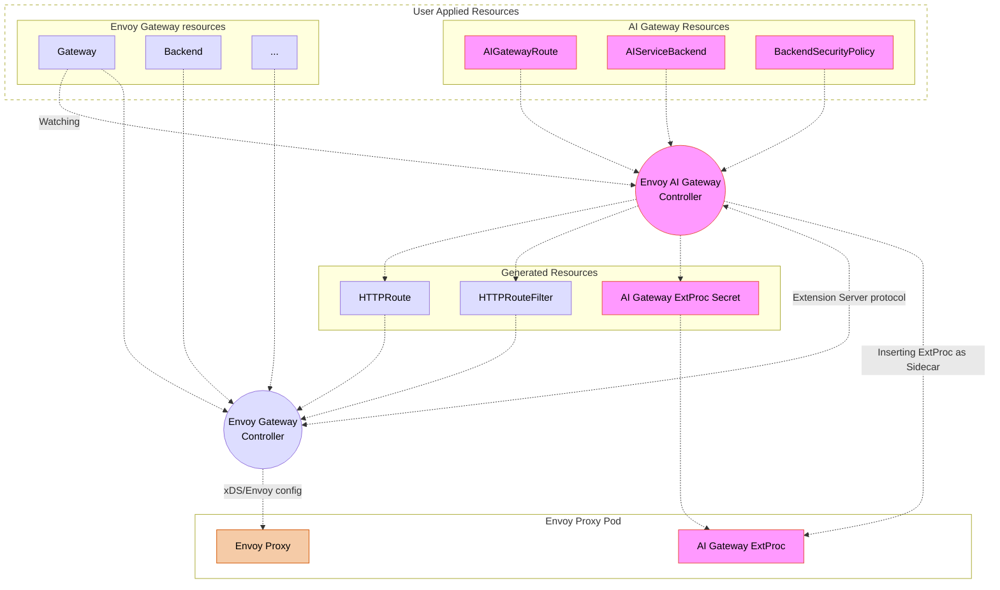

# Control Plane Explained

The control plane is responsible for configuring and managing the system. It consists of several key components working together to manage the AI Gateway configuration.

## How It Works

The control plane operates through a chain of components that work together to manage the configuration:

1. The Envoy AI Gateway controller watches AI Gateway Custom Resources (CRs)
2. When changes are detected, it updates/generates the Envoy Gateway configuration
3. The Envoy Gateway communicates with the Envoy AI Gateway controller via the [Envoy Gateway Extension server] protocol, and the Envoy AI Gateway controller then fine-tunes the xDS configuration before the Envoy Gateway applies it to the Envoy Proxy.
4. The data plane (Envoy Proxy) processes AI traffic based on this configuration where the AI Gateway ExtProc runs as a sidecar to handle AI-specific processing. The sidecar container is inserted by the AI Gateway controller into the Envoy Proxy Pod.

This architecture ensures a clear separation of concerns, where the AI Gateway controller focuses on AI-specific configuration while leveraging Envoy Gateway for general proxy management.

## Components

### 1. Envoy AI Gateway Controller

The AI Gateway Controller manages AI-specific components and configurations:

#### ExtProc Management

- Creates and updates ExtProc Secrets with processing rules as well as credentials
- Inserts the AI Gateway ExtProc as a [sidecar container](https://kubernetes.io/docs/concepts/workloads/pods/sidecar-containers/) in the Envoy Proxy Pod via the [Kubernetes Admission Webhooks](https://kubernetes.io/docs/reference/access-authn-authz/extensible-admission-controllers/). The container mounts the ExtProc config secret and communicates with the Envoy Proxy to process AI traffic.

#### Resource Management

- Watches AI Gateway Custom Resources (CRs)
- Creates and manages `HTTPRoute` and `HTTPRouteFilter` resources
- Manages backend security policies and authentication, including the credentials rotation

#### Integration with Envoy Gateway

- Works alongside Envoy Gateway Controller (not directly configuring Envoy)
- Creates resources, such as `HTTPRoute`, that Envoy Gateway translates into Envoy configuration with AI-specific processing rules
- Serves the [Envoy Gateway Extension Server] to fine-tune the Envoy configuration (xDS)
- Enables token-based rate limiting through metadata

### 2. Envoy Gateway Controller

- Manages the core Envoy configuration through xDS
- Handles service discovery and load balancing
- Manages TLS certificates
- Translates Gateway API resources into Envoy configuration

## Notable Rationale

- As explained, [Envoy Gateway Extension server] is used for fine-tuning the xDS configuration to implement our features. This allows us to leverage Envoy Gateway for core proxy management while still customizing the configuration for AI-specific needs.
  - For example, upstream filters (HTTP filter attached per Backend) is not supported in Envoy Gateway, so the AI Gateway controller uses the extension server to achieve this, which is essential to implement per-model priority routing.
  - Another example is that backendRef level priority configuration is not supported in Gateway API or Envoy Gateway, so the AI Gateway controller uses the extension server to insert this configuration into the xDS.
- Delegating core proxy management to Envoy Gateway allows us to focus on AI-specific features and configurations, reducing duplication of effort and leveraging the strengths of both controllers.
  - For example, we don't need to re-implement Gateway API resource translation, service discovery, load balancing, and TLS management.
- Inserting the ExtProc as a sidecar container brings the following benefits:
  - Performance: Running the ExtProc as a sidecar within the same Pod as Envoy Proxy reduces network latency and overhead, leading to faster processing of AI traffic. Notably, the communication between Envoy Proxy and the ExtProc happens over a local Unix Domain Socket (UDS), not over the network.
  - Simplified Deployment: Managing the ExtProc as part of the Envoy Proxy Pod simplifies deployment and scaling, as both components can be managed together.
  - Session Affinity: Running as a sidecar naturally ensures the session affinity between Envoy Proxy and the ExtProc which is crucial for implementing provider fallbacks. As we explain in [Data Plane and Traffic Flow], we have two phases in the request processing:
    Router-level and Upstream-level processing to handle provider fallbacks. Since Envoy does not support session affinity for External Processor access as of this writing, without the session affinity, the Upstream-level ExtProc might end up talking to a different ExtProc instance which does not have the context of the router level processing (mainly the original request body and headers).

## Next Steps

To learn more:

- Understand the [Data Plane and Traffic Flow]

[Envoy Gateway Extension server]: https://gateway.envoyproxy.io/docs/tasks/extensibility/extension-server/
[Data Plane and Traffic Flow]: ./data-plane.md
