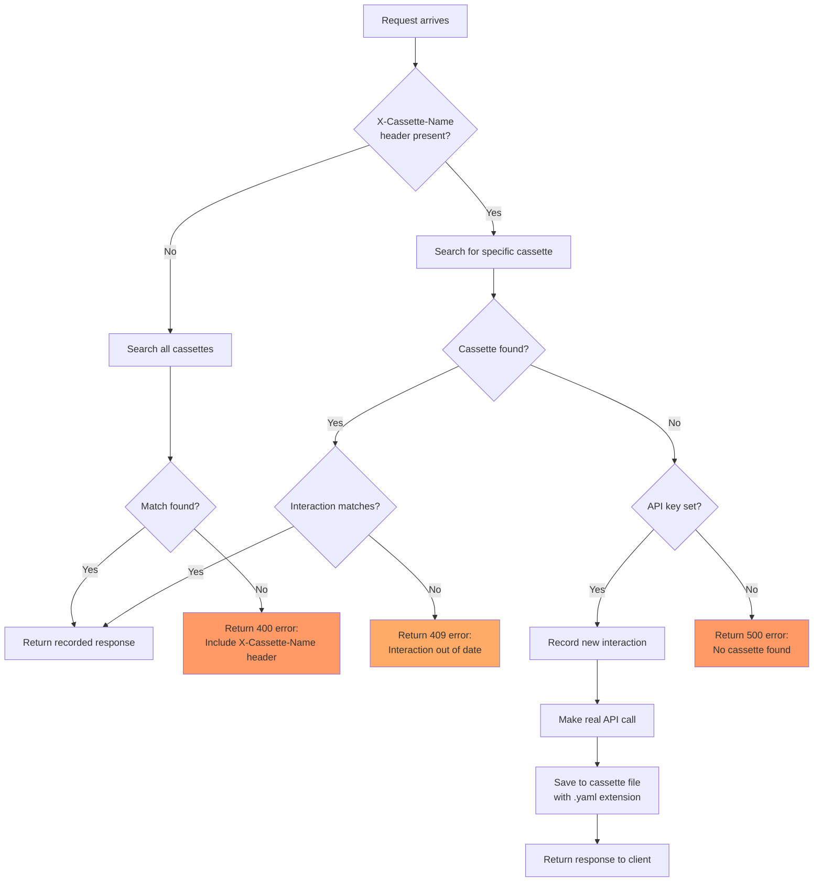

# Test OpenAI Server

This package provides a test OpenAI API server for testing AI Gateway functionality
without requiring actual API access or credentials.

Pre-recorded OpenAI request/responses are stored as YAML files in the
[cassettes](cassettes) directory, using the go-vcr v4 format.

## Overview

The test server works by:

1. Automatically loading all pre-recorded API interactions from embedded "cassette" YAML files
2. Matching incoming requests against recorded interactions based on the `X-Cassette-Name` header
3. Replaying the recorded responses with delays faster than real platforms to keep tests fast.

This approach provides:

- **Deterministic testing**: Same inputs always produce same outputs
- **No API credentials needed**: Tests can run without OpenAI API keys
- **Fast execution**: No network calls to external services
- **Cost savings**: No API usage charges during testing

## Usage

### Basic Usage

```go
import (
	"testing"
	"github.com/envoyproxy/ai-gateway/internal/testopenai"
)

func TestMyFeature(t *testing.T) {
	// Create server on random port - cassettes are automatically loaded
	server, err := testopenai.NewServer()
	require.NoError(t, err)
	defer server.Close()

	// Create a request for a specific cassette
	req, err := testopenai.NewRequest(server.URL(), testopenai.CassetteChatBasic)
	require.NoError(t, err)

	// Make the request
	resp, err := http.DefaultClient.Do(req)
	// ... test your code
}
```

## Recording New Cassettes

The test server can record new interactions when:

- No matching cassette is found
- `OPENAI_API_KEY` or `AZURE_OPENAI_API_KEY` is set in the environment
- A cassette name is provided via `X-Cassette-Name` header

To record a new cassette, follow these steps:

1. **Add a constant** for your test scenario to [requests.go](requests.go):

   ```go
   const (
   	// ... existing constants
   	// CassetteChatFeatureX includes feature X, added to OpenAI version 1.2.3.
   	CassetteChatFeatureX
   	_cassetteNameEnd // Keep this at the end
   )
   ```

   > **Note**: The constants use `iota` enumeration, so your new constant must be added
   > before `_cassetteNameEnd` to be included in the `AllCassettes()` iteration.

   Also add its string mapping:

   ```go
   var stringValues = map[CassetteName]string{
   	// ... existing mappings
   	CassetteChatFeatureX: "chat-feature-x",
   }
   ```

2. **Add the request body** for your test to [requests.go](requests.go):

   ```go
   var requestBodies = map[CassetteName]*openai.ChatCompletionRequest{
   	// ... existing entries
   	CassetteChatFeatureX: {
   		Model: openai.ModelGPT41Nano,
   		Messages: []openai.ChatCompletionMessageParamUnion{
   			{
   				Type: openai.ChatMessageRoleUser,
   				Value: openai.ChatCompletionUserMessageParam{
   					Role: openai.ChatMessageRoleUser,
   					Content: openai.StringOrUserRoleContentUnion{
   						Value: "Your test prompt",
   					},
   				},
   			},
   		},
   		// Add your feature-specific fields here
   	},
   }
   ```

3. **Run `TestNewRequest`** with your API credentials set:

   For OpenAI:

   ```bash
   cd tests/internal/testopenai
   OPENAI_API_KEY=sk-.. go test -run TestNewRequest -v
   ```

   For Azure OpenAI:

   ```bash
   cd tests/internal/testopenai
   AZURE_OPENAI_API_KEY=your-key \
     AZURE_OPENAI_ENDPOINT=https://your-resource.cognitiveservices.azure.com \
     AZURE_OPENAI_DEPLOYMENT=your-deployment-name \
     OPENAI_API_VERSION=2024-02-15-preview \
     go test -run TestNewRequest -v
   ```

4. Use it in tests like [chat_completions_test.go](../../extproc/vcr/chat_completions_test.go)

## Flowchart of Request Handling



### Future work

OpenAI is not the only inference API supported, but it is special as it is
the most common frontend and backend for AI Gateway. This is why we expose the
requests, as we will often proxy these even if the backend is not OpenAI
compatible.

The recording process would remain consistent for other cloud services, such as
Anthropic or Bedrock, though there could be variations in how requests are
scrubbed for secrets or handled for request signing. In a future refactoring,
we could extract the core recording infrastructure into a separate package,
reducing this one to just cassette constants and OpenAI-specific request
recording and handling details. Most of the code could be reused for other
backends.

For additional insights, refer to OpenTelemetry instrumentation, which often
employs VCR for LLM frameworks as well.

Here are key parts of the OpenTelemetry Botocore Bedrock instrumentation that
deals with request signing and recording:

- [test_botocore_bedrock.py#](https://github.com/open-telemetry/opentelemetry-python-contrib/blob/77f3171bd4d0ca8eb5501c8c493364f7b6c8859a/instrumentation/opentelemetry-instrumentation-botocore/tests/test_botocore_bedrock.py#L403)
- [conftest.py](https://github.com/open-telemetry/opentelemetry-python-contrib/blob/77f3171bd4d0ca8eb5501c8c493364f7b6c8859a/instrumentation/opentelemetry-instrumentation-botocore/tests/conftest.py#L77)

Here are key parts of OpenInference Anthropic instrumentation, which handles
their endpoint.

- [test_instrumentor.py](https://github.com/Arize-ai/openinference/blob/main/python/instrumentation/openinference-instrumentation-anthropic/tests/openinference/anthropic/test_instrumentor.py)
